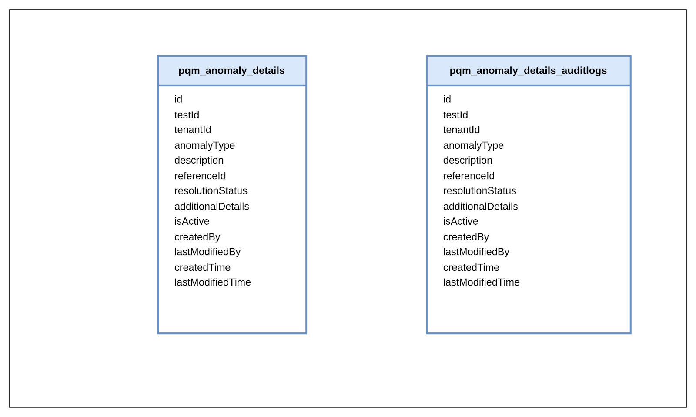

# PQM Anomaly Finder

## **Overview**

The Process Quality Management (PQM) anomaly finder service helps in monitoring anomalies in process quality and notifies the concerned user groups.&#x20;


### Master Data Types

The following masters need to be created as part of this module:

* Plant
* PlantConfig

## Dependencies

List of services that PQM service depends on:

### **User-Event Service**

User-event service api will get the notification for the anomaly .

Deploy the latest build  if the service is not there in the environment “egov-user-event-db:v1.2.0-32caf0d992-25”    .

Add the changes which are required . For this kindly refer the below pr.

Path: deploy-as-code/helm/charts/core-services/egov-user-event/Chart.yaml

File: [Refer the pr for the changes](https://github.com/egovernments/DIGIT-DevOps/commit/b18930c7d3a11f357c3b0334cbb5ecfc21b4d76c#diff-48f616705dd9404c25fa80038d7ecb01e37e65b67477cb4cb5dd4a59bd935374)&#x20;

### [**Notification**](https://core.digit.org/platform/core-services/sms-notification-service)

Note: For the test not submitted notification, the notification will only be sent when the frequency of a [test standard](../../../../release-notes/mdms-changes.md#pqm.teststandard) is greater than the manualTestPendingEscalationDays from [Plant Config Master](../../../../release-notes/mdms-changes.md#pqm.plantconfig)

#### **Localisation**

Alert notification format needs to add in localisation.&#x20;

```
[
  {
    "code": "NOTIF_TEST_RESULT_NOT_SUBMITTED",
    "message": "Lab results for plant {Plant Name} for {Output} of {Stage} stage scheduled on {Test Scheduled Date} has not yet been submitted.",
    "module": "rainmaker-tqm",
    "locale": "en_IN"
  },
  {
    "code": "NOTIF_TEST_RESULT_NOT_AS_PER_BENCHMARK",
    "message": "Lab results submitted for plant {Plant Name} for {Output} of {Stage} stage submitted on {Test Submitted Date} is not as per benchmark values.",
    "module": "rainmaker-tqm",
    "locale": "en_IN"
  }
]
```


### Postman Collection

Link to [collection](https://api.postman.com/collections/23418568-693209f3-baa6-4a54-9856-80733947a964?access\_key=PMAT-01HDZNAJ42904BG2KY25M5EHZ1)

### API Specification

[PQM Anomaly Swagger Link](https://github.com/egovernments/SANITATION/blob/develop/API-CONTRACTS/pqm/PQM\_API\_ANOMALY\_Contract.yaml)

## Kafka Topic Details

| Event (In-App) Notification                      | persist-user-events-async            |
| ------------------------------------------------ | ------------------------------------ |
| Anomaly topic for when a test fails              | save-pqm-test-anomaly-details        |
| Anomaly topic for when test result not submitted | testResultNotSubmitted-anomaly-topic |
| Save anomaly topic                               | create-pqm-anomaly-finder            |

## ER Diagram

<figure><figcaption></figcaption></figure>

## Sequence Diagram

Find Anomaly

<figure><figcaption></figcaption></figure>

## Reference Docs

### Doc Links <a href="#doc-links" id="doc-links"></a>

<table><thead><tr><th width="611"></th><th></th></tr></thead><tbody><tr><td><strong>Title</strong></td><td><strong>Link</strong></td></tr><tr><td>User Technical Document</td><td><a href="https://core.digit.org/platform/core-services/user-services">User Service</a></td></tr><tr><td>MDMS Technical Document</td><td><a href="https://core.digit.org/platform/core-services/mdms-master-data-management-service">M<strong>dms service</strong></a></td></tr><tr><td>Localisation Technical Document</td><td><a href="https://core.digit.org/platform/core-services/location-services">Localization service</a></td></tr><tr><td>Persister Technical Document</td><td><a href="https://core.digit.org/platform/core-services/persister-service">Persister service</a></td></tr><tr><td>API Contract</td><td><a href="https://github.com/egovernments/SANITATION/blob/develop/API-CONTRACTS/pqm/PQM_API_ANOMALY_Contract.yaml">API Contract</a></td></tr><tr><td>Postman Collection</td><td><a href="https://api.postman.com/collections/23418568-693209f3-baa6-4a54-9856-80733947a964?access_key=PMAT-01HDZNAJ42904BG2KY25M5EHZ1">Postman Collection</a></td></tr></tbody></table>

### API List <a href="#api-list" id="api-list"></a>

<table data-header-hidden><thead><tr><th width="301.3333333333333"></th><th></th></tr></thead><tbody><tr><td><h4>Title </h4></td><td>Link</td></tr><tr><td>pqm-anomaly-finder/v1/_search</td><td><a href="https://api.postman.com/collections/23418568-693209f3-baa6-4a54-9856-80733947a964?access_key=PMAT-01HDZNAJ42904BG2KY25M5EHZ1">Postman Collection</a></td></tr><tr><td>pqm-anomaly-finder/v1/_plainsearch</td><td><a href="https://api.postman.com/collections/23418568-693209f3-baa6-4a54-9856-80733947a964?access_key=PMAT-01HDZNAJ42904BG2KY25M5EHZ1">Postman Collection</a></td></tr></tbody></table>

\
\
