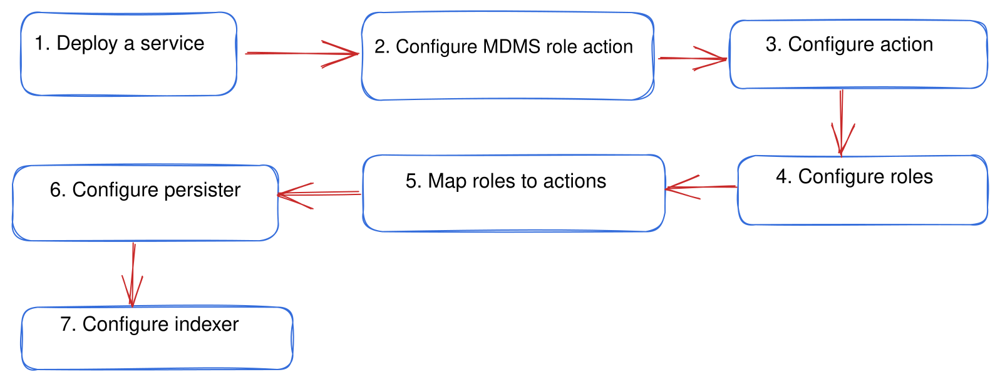

# Configuration

## Overview

On this page, you will find a set of standard configuration steps that should be applied consistently across all services. Please adhere to these steps within the context of each service, making necessary replacements only as instructed by the respective service's guidelines.

**Steps:**

<figure><figcaption></figcaption></figure>

## Deploy A Service

Deploying a service encompasses three key aspects:

1. **Service Image Deployment**: This entails deploying a published Docker image of the service within the DIGIT environment.
2. **Helm Charts Requirement**: Helm charts play a crucial role in service deployment as they configure environment variables tailored to the specific Kubernetes cluster. You can deploy a service either through CI/CD pipelines or directly by utilizing Helm commands from your system. All helm charts for PQM services are [available in this repository.](https://github.com/egovernments/DIGIT-DevOps/tree/unified-env/deploy-as-code/helm/charts/sanitation)&#x20;
3. **Service Configuration**: To ensure the service functions seamlessly, it is essential to configure it correctly. This includes setting up MDMS, IDGen, Workflow, and other masters as necessary, all of which can be done on GitHub.

In summary, deploying a service involves these three fundamental steps, each contributing to the successful deployment and operation of the service within the DIGIT environment.


## MDMS Role Action Configuration

[Click here](https://core.digit.org/platform/core-services/mdms-master-data-management-service) to find detailed information on MDMS configuration.

All modules expose certain actions (APIs), roles (actors) and role-action mappings (who can access which resource). Role-action mappings are used for access control.&#x20;

Each service documentation has a role-action table that identifies the actors that can access the resource. Follow the outline below replacing specific actions/roles for each module.&#x20;

Actions, roles and role-action mapping are defined within a master tenant in folders. The folders have the same name as the module name for easy identification.&#x20;

Example:

<figure><figcaption></figcaption></figure>

In the above image, "pg" is the state level tenant. The three folders highlighted in orange contain the masters for actions, roleactions and roles respectively.&#x20;


Folder structures are only for categorisation and easy navigation of master files. The MDMS service retrieves  data only through module and master names. Make sure that these are correct.


## Configure Actions

* Add all the APIs exposed by the service (refer to service for actual APIs) to the <mark style="background-color:orange;">`actions.json`</mark> file in MDMS.&#x20;
* Keep appending new entries to the bottom of the file.&#x20;
* Make sure the `id` field is unique. Best practice is to increment the id by one when adding a new entry. This id field will be used in the role-action mapping.

**Module name:** ACCESSCONTROL-ACTIONS-TEST

**Master name:** actions-test


In case 403s are encountered despite configuration, double check the actions.json file to make sure the API in question has a unique ID. In case of duplicate IDs, a 403 will be thrown by Zuul.


#### Example:

A sample entry given below:

```json
{
      "id": {unique ID},
      "name": "Create Estimate",
      "url": "/estimate-service/estimate/v1/_create",
      "parentModule": "estimate-service",
      "displayName": "Create Estimate",
      "orderNumber": 0,
      "enabled": false,
      "serviceCode": "estimate-service",
      "code": "null",
      "path": ""
    },
    {
      "id": {unique ID},
      "name": "Search Estimate",
      "url": "/estimate-service/estimate/v1/_search",
      "parentModule": "estimate-service",
      "displayName": "Search Estimate",
      "orderNumber": 0,
      "enabled": false,
      "serviceCode": "estimate-service",
      "code": "null",
      "path": ""
    },
    {
      "id": {unique ID},
      "name": "Update Estimate",
      "url": "/estimate-service/estimate/v1/_update",
      "parentModule": "estimate-service",
      "displayName": "Update Estimate",
      "orderNumber": 0,
      "enabled": false,
      "serviceCode": "estimate-service",
      "code": "null",
      "path": ""
    },
```

## Configure Roles

Configure roles based on the roles column (refer to service documentation) in the roles.json file. Make sure the role does not exist already. Append new roles to the bottom of the file.&#x20;

**Module name:** ACCESSCONTROL-ROLES

**Master name:** roles


#### Assign EMPLOYEE\_COMMON to all actors in the Works platform.


#### Example:

A sample entry is given below:

```json
{
      "code": "ESTIMATE_CREATOR",
      "name": "ESTIMATE CREATOR",
      "description": "Estimate Creator"
    },
    {
      "code": "ESTIMATE_VIEWER",
      "name": "ESTIMATE VIEWER",
      "description": "Estimate VIEWER having search api access"
    },
```

## Configure Role Action

Role-action mapping should be configured as per the role-action table defined. Add new entries to the bottom of the roleactions.json file.&#x20;

Identify the action id (from the actions.json file) and map roles to that id. If multiple roles are mapped to an API, then each of them becomes a unique entry in the roleactions.json file.

**Module name:** ACCESSCONTROL-ROLEACTIONS

**Master name:** roleactions.json

#### Example:

A sample set of role-action entries is shown below. Each of the `actionid` fields needs to match a corresponding API from the actions.json file.&#x20;

In the example below the `ESTIMATE_CREATOR` is given access to API actionid 9. This maps to the estimate create API in our repository.&#x20;


Note that the `actionid` and `tenantId` might differ from implementation to implementation.&#x20;


```json
 {
      "rolecode": "ESTIMATE_CREATOR",
      "actionid": 9,
      "actioncode": "",
      "tenantId": "pg"
    },
    {
      "rolecode": "ESTIMATE_VERIFIER",
      "actionid": 11,
      "actioncode": "",
      "tenantId": "pg"
    },
    {
      "rolecode": "TECHNICAL_SANCTIONER",
      "actionid": 11,
      "actioncode": "",
      "tenantId": "pg"
    }
```

## Persister Configuration

Each service has a persister.yaml file which needs to be stored in the configs repository. The actual file will be mentioned in the service documentation.&#x20;

Please add that yaml file under the configs repository if not present already.


Make sure to restart MDMS and the persister service after adding the file at the above location.


## Indexer Configuration

Each service has a indexer.yaml file which needs to be stored in the configs repository. The actual file will be mentioned in the service documentation.&#x20;

Please add that yaml file under the configs repository if not present already.


Make sure to restart MDMS and the persister service after adding the file at the above location.

