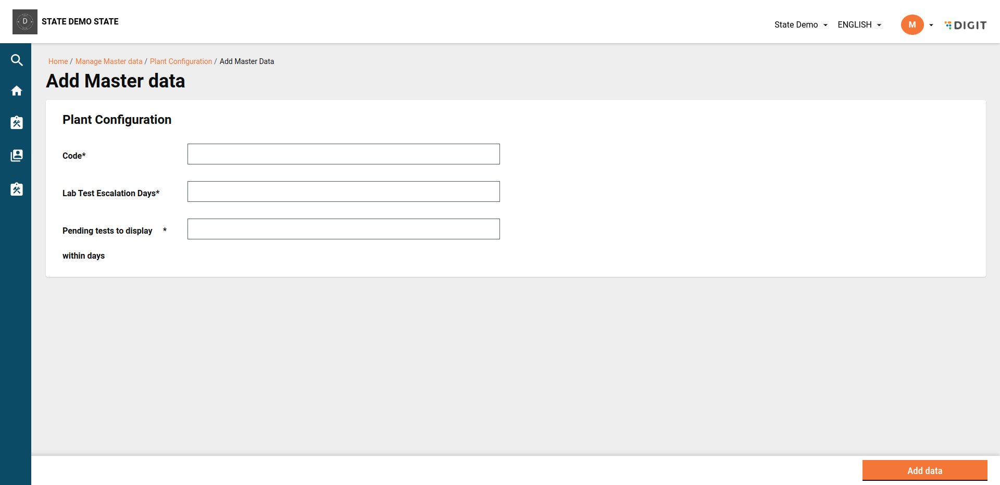
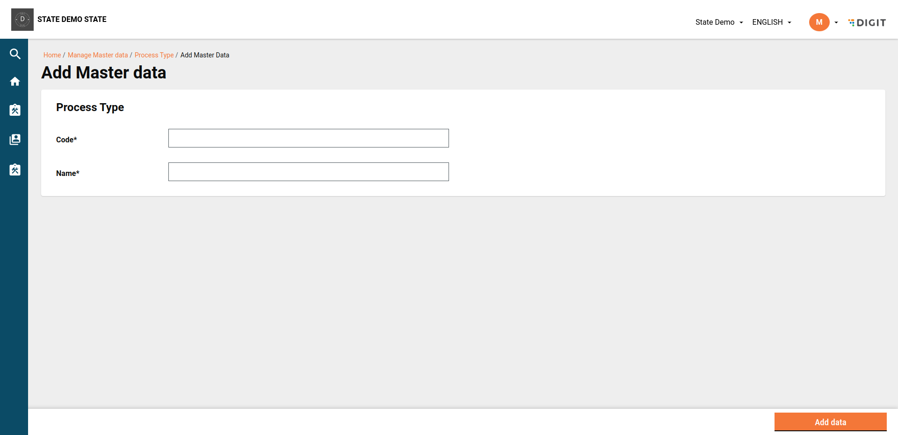
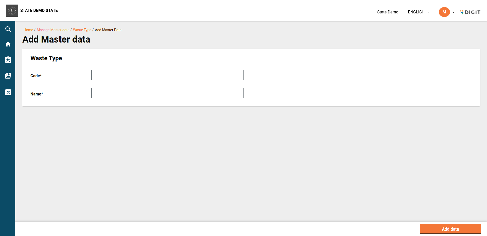
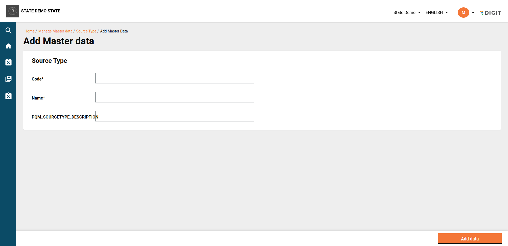
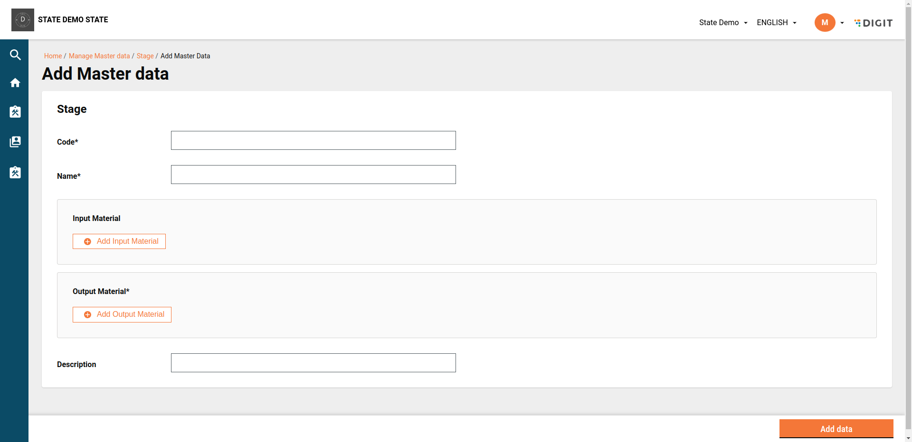
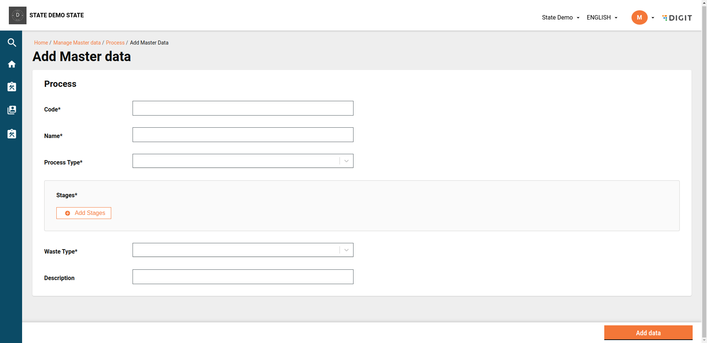
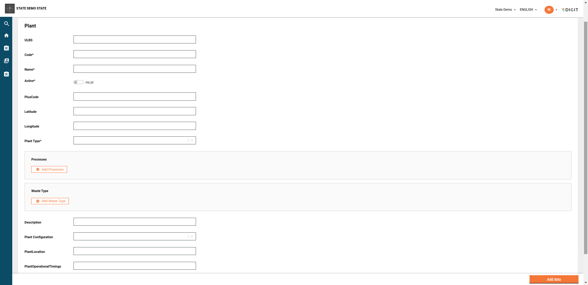
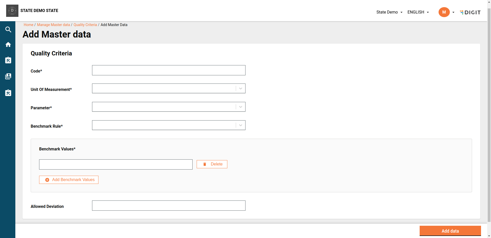
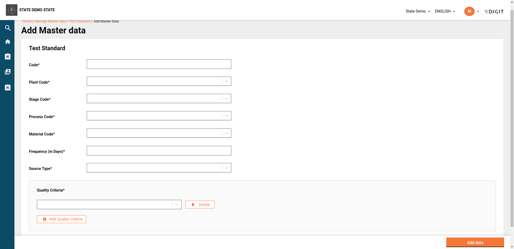

# MDMS Changes

## Overview

The following MDMS changes were done as part of the FSM v1.4 release:&#x20;

## **MDMS Changes**

| Feature     | Service name   | Changes                                                                                                                           | Description                                                              |
| ----------- | -------------- | --------------------------------------------------------------------------------------------------------------------------------- | ------------------------------------------------------------------------ |
| PQM inbox   | MDMS for inbox | [PR#3123](https://github.com/egovernments/egov-mdms-data/blob/UNIFIED-DEV/data/pg/inbox-v2/InboxConfiguration.json#L417C3-L501C4) | <p></p><p>Added MDMS configuration for inbox-v2 integration.</p>         |
| Role Action | MDMS           |                                                                                                                                   | <p></p><p>Added role-action mapping for all APIs of the PQM service.</p> |

For **MDMS-V2** changes, refer to the below table for the sequence in which MDMS schema and data needs to be added for the PQM service:

<table><thead><tr><th width="208">MasterName</th><th width="115">Schema Link</th><th width="233">Required Fields</th><th>Unique Fields</th></tr></thead><tbody><tr><td>PQM.BenchmarkRule</td><td><a href="https://api.postman.com/collections/29291851-f54597de-51a5-4218-ac75-ab163f9c8f34?access_key=PMAT-01HNAVJSMAPRM5FA4SKEDTGG51">Postman Collection</a></td><td>id, code, name</td><td>code</td></tr><tr><td>PQM.QualityTestLab</td><td><a href="https://api.postman.com/collections/29291851-f54597de-51a5-4218-ac75-ab163f9c8f34?access_key=PMAT-01HNAVJSMAPRM5FA4SKEDTGG51">Postman Collection</a></td><td>code</td><td>code</td></tr><tr><td>PQM.Material</td><td><a href="https://api.postman.com/collections/29291851-f54597de-51a5-4218-ac75-ab163f9c8f34?access_key=PMAT-01HNAVJSMAPRM5FA4SKEDTGG51">Postman Collection</a></td><td>code, name</td><td>code</td></tr><tr><td>PQM.Parameter</td><td><a href="https://api.postman.com/collections/29291851-f54597de-51a5-4218-ac75-ab163f9c8f34?access_key=PMAT-01HNAVJSMAPRM5FA4SKEDTGG51">Postman Collection</a></td><td>code, name</td><td>code</td></tr><tr><td>PQM.PlantConfig</td><td><a href="https://api.postman.com/collections/29291851-f54597de-51a5-4218-ac75-ab163f9c8f34?access_key=PMAT-01HNAVJSMAPRM5FA4SKEDTGG51">Postman Collection</a></td><td>code, pendingTestsToDisplayWithinDays, pendingTestsToDisplayWithinDaysInbox, pendingTestsToDisplayWithinDaysForULB, iotAnomalyDetectionDays, manualTestPendingEscalationDays</td><td>code</td></tr><tr><td>PQM.PlantType</td><td><a href="https://api.postman.com/collections/29291851-f54597de-51a5-4218-ac75-ab163f9c8f34?access_key=PMAT-01HNAVJSMAPRM5FA4SKEDTGG51">Postman Collection</a></td><td>code, name</td><td>code</td></tr><tr><td>PQM.ProcessType</td><td><a href="https://api.postman.com/collections/29291851-f54597de-51a5-4218-ac75-ab163f9c8f34?access_key=PMAT-01HNAVJSMAPRM5FA4SKEDTGG51">Postman Collection</a></td><td>code, name</td><td>code</td></tr><tr><td>PQM.Unit</td><td><a href="https://api.postman.com/collections/29291851-f54597de-51a5-4218-ac75-ab163f9c8f34?access_key=PMAT-01HNAVJSMAPRM5FA4SKEDTGG51">Postman Collection</a></td><td>code, name</td><td>code</td></tr><tr><td>PQM.WasteType</td><td><a href="https://api.postman.com/collections/29291851-f54597de-51a5-4218-ac75-ab163f9c8f34?access_key=PMAT-01HNAVJSMAPRM5FA4SKEDTGG51">Postman Collection</a></td><td>code, name</td><td>code</td></tr><tr><td>PQM.SourceType</td><td><a href="https://api.postman.com/collections/29291851-f54597de-51a5-4218-ac75-ab163f9c8f34?access_key=PMAT-01HNAVJSMAPRM5FA4SKEDTGG51">Postman Collection</a></td><td>code, name</td><td>code</td></tr><tr><td>PQM.Stage</td><td><a href="https://api.postman.com/collections/29291851-f54597de-51a5-4218-ac75-ab163f9c8f34?access_key=PMAT-01HNAVJSMAPRM5FA4SKEDTGG51">Postman Collection</a></td><td>code, name, output</td><td>code</td></tr><tr><td>PQM.Process</td><td><a href="https://api.postman.com/collections/29291851-f54597de-51a5-4218-ac75-ab163f9c8f34?access_key=PMAT-01HNAVJSMAPRM5FA4SKEDTGG51">Postman Collection</a></td><td>code, type, name, stages, wasteType</td><td>code</td></tr><tr><td>PQM.Plant</td><td><a href="https://api.postman.com/collections/29291851-f54597de-51a5-4218-ac75-ab163f9c8f34?access_key=PMAT-01HNAVJSMAPRM5FA4SKEDTGG51">Postman Collection</a></td><td>code, plantType, active</td><td>code</td></tr><tr><td>PQM.QualityCriteria</td><td><a href="https://api.postman.com/collections/29291851-f54597de-51a5-4218-ac75-ab163f9c8f34?access_key=PMAT-01HNAVJSMAPRM5FA4SKEDTGG51">Postman Collection</a></td><td>code, name, plantType, wasteType, address, processes</td><td>code</td></tr><tr><td>PQM.TestStandard</td><td><a href="https://api.postman.com/collections/29291851-f54597de-51a5-4218-ac75-ab163f9c8f34?access_key=PMAT-01HNAVJSMAPRM5FA4SKEDTGG51">Postman Collection</a></td><td>code, plant, process, stage, material, qualityCriteria, frequency, sourceType</td><td>code</td></tr></tbody></table>

## UI-Related MDMS Files

* Make sure TQM and FSM is enabled in this master -> [cityModule.json](https://github.com/egovernments/egov-mdms-data/blob/7a54806acf62aef1180f924a0cd668ca41d99bbc/data/pg/tenant/citymodule.json)
* data/pg/common-masters/howItWorks.json -> [ HowItWorks](https://github.com/egovernments/egov-mdms-data/blob/39ec22c47d3ff972dc4a3ef4ffec6b1464aca45a/data/pg/common-masters/howItWorks.json)
* data/pg/FSM/SanitationWorkerSkills.json -> [SanitationWorkerSkills](https://github.com/egovernments/egov-mdms-data/blob/8ad0ed596708f62e829c1d798736710801a7b7a0/data/pg/FSM/SanitationWorkerSkills.json)
* data/pg/FSM/SanitationWorkerEmploymentType.json -> [File Link](https://github.com/egovernments/egov-mdms-data/blob/fc219516709b664c803911faf6dfa45b0a01b77a/data/pg/FSM/SanitationWorkerEmploymentType.json)
* data/pg/FSM/SanitationWorkerEmployer.json -> [File Link](https://github.com/egovernments/egov-mdms-data/blob/8ad0ed596708f62e829c1d798736710801a7b7a0/data/pg/FSM/SanitationWorkerEmployer.json)
* data/pg/FSM/SanitationWorkerFunctionalRoles.json -> [File Link](https://github.com/egovernments/egov-mdms-data/blob/8ad0ed596708f62e829c1d798736710801a7b7a0/data/pg/FSM/SanitationWorkerFunctionalRoles.json)

## Role-Action Mapping

data/pg/ACCESSCONTROL-ACTIONS-TEST/actions-test.json

```json
{
      "id": 346,
      "name": "schema Create",
      "url": "/mdms-v2/schema/v1/_create",
      "parentModule": "",
      "displayName": "Schema Create",
      "orderNumber": 0,
      "enabled": false,
      "serviceCode": "",
      "code": "null",
      "path": ""
    },
    {
    "id": 357,
    "name": "Search  PQM Application",
    "url": "/mdms-v2/schema/v1/_search",
    "displayName": "Search MDMS Schema",
    "orderNumber": 0,
    "enabled": false,
    "serviceCode": "PQM",
    "code": "null",
    "path": ""
  }
{
      "id": 347,
      "name": "MDMS",
      "url": "/mdms-v2/v2/_create/PQM.SourceType",
      "parentModule": "",
      "displayName": "Add Data for PQM.SourceType",
      "orderNumber": 0,
      "enabled": false,
      "serviceCode": "",
      "code": "null",
      "path": ""
    },
     {
      "id": 201,
      "name": "MDMS",
      "url": "url",
      "displayName": "Manage PQM Labs",
      "orderNumber": 1,
      "parentModule": "",
      "enabled": true,
      "serviceCode": "MDMS",
      "code": "null",
      "navigationURL": "/workbench-ui/employee/workbench/mdms-search-v2?moduleName=PQM&masterName=QualityTestLab",
      "path": "9MDMS.PQM.QualityTestLab",
      "leftIcon": "dynamic:ContractIcon"
    },
    {
      "id": 202,
      "name": "MDMS",
      "url": "/mdms-v2/v2/_create/PQM.QualityTestLab",
      "displayName": "create PQM.QualityTestLab",
      "orderNumber": 1,
      "parentModule": "",
      "enabled": true,
      "serviceCode": "MDMS",
      "code": "null",
      "path": ""
    },
    {
      "id": 203,
      "name": "MDMS",
      "url": "/mdms-v2/v2/_update/PQM.QualityTestLab",
      "displayName": "Update PQM.QualityTestLab",
      "orderNumber": 1,
      "parentModule": "",
      "enabled": true,
      "serviceCode": "MDMS",
      "code": "null",
      "path": ""
    },
    {
      "id": 204,
      "name": "MDMS",
      "url": "url",
      "displayName": "Manage PQM BenchmarkRule",
      "orderNumber": 1,
      "parentModule": "",
      "enabled": true,
      "serviceCode": "MDMS",
      "code": "null",
      "navigationURL": "/workbench-ui/employee/workbench/mdms-search-v2?moduleName=PQM&masterName=BenchmarkRule",
      "path": "9MDMS.PQM.BenchmarkRule",
      "leftIcon": "dynamic:ContractIcon"
    },
    {
      "id": 205,
      "name": "MDMS",
      "url": "/mdms-v2/v2/_create/PQM.BenchmarkRule",
      "displayName": "create PQM.BenchmarkRule",
      "orderNumber": 1,
      "parentModule": "",
      "enabled": true,
      "serviceCode": "MDMS",
      "code": "null",
      "path": ""
    },
    {
      "id": 206,
      "name": "MDMS",
      "url": "/mdms-v2/v2/_update/PQM.BenchmarkRule",
      "displayName": "Update PQM.BenchmarkRule",
      "orderNumber": 1,
      "parentModule": "",
      "enabled": true,
      "serviceCode": "MDMS",
      "code": "null",
      "path": ""
    },
    {
      "id": 207,
      "name": "MDMS",
      "url": "url",
      "displayName": "Manage PQM Material",
      "orderNumber": 1,
      "parentModule": "",
      "enabled": true,
      "serviceCode": "MDMS",
      "code": "null",
      "navigationURL": "/workbench-ui/employee/workbench/mdms-search-v2?moduleName=PQM&masterName=Material",
      "path": "9MDMS.PQM.Material",
      "leftIcon": "dynamic:ContractIcon"
    },
    {
      "id": 208,
      "name": "MDMS",
      "url": "/mdms-v2/v2/_create/PQM.Material",
      "displayName": "create PQM.Material",
      "orderNumber": 1,
      "parentModule": "",
      "enabled": true,
      "serviceCode": "MDMS",
      "code": "null",
      "path": ""
    },
    {
      "id": 209,
      "name": "MDMS",
      "url": "/mdms-v2/v2/_update/PQM.Material",
      "displayName": "Update PQM.Material",
      "orderNumber": 1,
      "parentModule": "",
      "enabled": true,
      "serviceCode": "MDMS",
      "code": "null",
      "path": ""
    },
    {
      "id": 210,
      "name": "MDMS",
      "url": "url",
      "displayName": "Manage PQM Unit",
      "orderNumber": 1,
      "parentModule": "",
      "enabled": true,
      "serviceCode": "MDMS",
      "code": "null",
      "navigationURL": "/workbench-ui/employee/workbench/mdms-search-v2?moduleName=PQM&masterName=Unit",
      "path": "9MDMS.PQM.Unit",
      "leftIcon": "dynamic:ContractIcon"
    },
    {
      "id": 211,
      "name": "MDMS",
      "url": "/mdms-v2/v2/_create/PQM.Unit",
      "displayName": "create PQM.Unit",
      "orderNumber": 1,
      "parentModule": "",
      "enabled": true,
      "serviceCode": "MDMS",
      "code": "null",
      "path": ""
    },
    {
      "id": 212,
      "name": "MDMS",
      "url": "/mdms-v2/v2/_update/PQM.Unit",
      "displayName": "Update PQM.Unit",
      "orderNumber": 1,
      "parentModule": "",
      "enabled": true,
      "serviceCode": "MDMS",
      "code": "null",
      "path": ""
    },
    {
      "id": 213,
      "name": "MDMS",
      "url": "url",
      "displayName": "Manage PQM TestType",
      "orderNumber": 1,
      "parentModule": "",
      "enabled": true,
      "serviceCode": "MDMS",
      "code": "null",
      "navigationURL": "/workbench-ui/employee/workbench/mdms-search-v2?moduleName=PQM&masterName=TestType",
      "path": "9MDMS.PQM.TestType",
      "leftIcon": "dynamic:ContractIcon"
    },
    {
      "id": 214,
      "name": "MDMS",
      "url": "/mdms-v2/v2/_create/PQM.TestType",
      "displayName": "create PQM.TestType",
      "orderNumber": 1,
      "parentModule": "",
      "enabled": true,
      "serviceCode": "MDMS",
      "code": "null",
      "path": ""
    },
    {
      "id": 215,
      "name": "MDMS",
      "url": "/mdms-v2/v2/_update/PQM.TestType",
      "displayName": "Update PQM.TestType",
      "orderNumber": 1,
      "parentModule": "",
      "enabled": true,
      "serviceCode": "MDMS",
      "code": "null",
      "path": ""
    },
    {
      "id": 216,
      "name": "MDMS",
      "url": "url",
      "displayName": "Manage PQM Plant",
      "orderNumber": 1,
      "parentModule": "",
      "enabled": true,
      "serviceCode": "MDMS",
      "code": "null",
      "navigationURL": "/workbench-ui/employee/workbench/mdms-search-v2?moduleName=PQM&masterName=Plant",
      "path": "9MDMS.PQM.Plant",
      "leftIcon": "dynamic:ContractIcon"
    },
    {
      "id": 217,
      "name": "MDMS",
      "url": "/mdms-v2/v2/_create/PQM.Plant",
      "displayName": "create PQM.Plant",
      "orderNumber": 1,
      "parentModule": "",
      "enabled": true,
      "serviceCode": "MDMS",
      "code": "null",
      "path": ""
    },
    {
      "id": 218,
      "name": "MDMS",
      "url": "/mdms-v2/v2/_update/PQM.Plant",
      "displayName": "Update PQM.Plant",
      "orderNumber": 1,
      "parentModule": "",
      "enabled": true,
      "serviceCode": "MDMS",
      "code": "null",
      "path": ""
    },
    {
      "id": 219,
      "name": "MDMS",
      "url": "url",
      "displayName": "Manage PQM PlantType",
      "orderNumber": 1,
      "parentModule": "",
      "enabled": true,
      "serviceCode": "MDMS",
      "code": "null",
      "navigationURL": "/workbench-ui/employee/workbench/mdms-search-v2?moduleName=PQM&masterName=PlantType",
      "path": "9MDMS.PQM.PlantType",
      "leftIcon": "dynamic:ContractIcon"
    },
    {
      "id": 220,
      "name": "MDMS",
      "url": "/mdms-v2/v2/_create/PQM.PlantType",
      "displayName": "create PQM.PlantType",
      "orderNumber": 1,
      "parentModule": "",
      "enabled": true,
      "serviceCode": "MDMS",
      "code": "null",
      "path": ""
    },
    {
      "id": 221,
      "name": "MDMS",
      "url": "/mdms-v2/v2/_update/PQM.PlantType",
      "displayName": "Update PQM.PlantType",
      "orderNumber": 1,
      "parentModule": "",
      "enabled": true,
      "serviceCode": "MDMS",
      "code": "null",
      "path": ""
    },
    {
      "id": 222,
      "name": "MDMS",
      "url": "url",
      "displayName": "Manage PQM Stage",
      "orderNumber": 1,
      "parentModule": "",
      "enabled": true,
      "serviceCode": "MDMS",
      "code": "null",
      "navigationURL": "/workbench-ui/employee/workbench/mdms-search-v2?moduleName=PQM&masterName=Stage",
      "path": "9MDMS.PQM.Stage",
      "leftIcon": "dynamic:ContractIcon"
    },
    {
      "id": 223,
      "name": "MDMS",
      "url": "/mdms-v2/v2/_create/PQM.Stage",
      "displayName": "create PQM.Stage",
      "orderNumber": 1,
      "parentModule": "",
      "enabled": true,
      "serviceCode": "MDMS",
      "code": "null",
      "path": ""
    },
    {
      "id": 224,
      "name": "MDMS",
      "url": "/mdms-v2/v2/_update/PQM.Stage",
      "displayName": "Update PQM.Stage",
      "orderNumber": 1,
      "parentModule": "",
      "enabled": true,
      "serviceCode": "MDMS",
      "code": "null",
      "path": ""
    },
    {
      "id": 225,
      "name": "MDMS",
      "url": "url",
      "displayName": "Manage PQM TestStandard",
      "orderNumber": 1,
      "parentModule": "",
      "enabled": true,
      "serviceCode": "MDMS",
      "code": "null",
      "navigationURL": "/workbench-ui/employee/workbench/mdms-search-v2?moduleName=PQM&masterName=TestStandard",
      "path": "9MDMS.PQM.TestStandard",
      "leftIcon": "dynamic:ContractIcon"
    },
    {
      "id": 226,
      "name": "MDMS",
      "url": "/mdms-v2/v2/_create/PQM.TestStandard",
      "displayName": "create PQM.TestStandard",
      "orderNumber": 1,
      "parentModule": "",
      "enabled": true,
      "serviceCode": "MDMS",
      "code": "null",
      "path": ""
    },
    {
      "id": 227,
      "name": "MDMS",
      "url": "/mdms-v2/v2/_update/PQM.TestStandard",
      "displayName": "Update PQM.TestStandard",
      "orderNumber": 1,
      "parentModule": "",
      "enabled": true,
      "serviceCode": "MDMS",
      "code": "null",
      "path": ""
    },
    {
      "id": 228,
      "name": "MDMS",
      "url": "url",
      "displayName": "Manage PQM QualityCriteria",
      "orderNumber": 1,
      "parentModule": "",
      "enabled": true,
      "serviceCode": "MDMS",
      "code": "null",
      "navigationURL": "/workbench-ui/employee/workbench/mdms-search-v2?moduleName=PQM&masterName=QualityCriteria",
      "path": "9MDMS.PQM.QualityCriteria",
      "leftIcon": "dynamic:ContractIcon"
    },
    {
      "id": 229,
      "name": "MDMS",
      "url": "/mdms-v2/v2/_create/PQM.QualityCriteria",
      "displayName": "create PQM.QualityCriteria",
      "orderNumber": 1,
      "parentModule": "",
      "enabled": true,
      "serviceCode": "MDMS",
      "code": "null",
      "path": ""
    },
    {
      "id": 230,
      "name": "MDMS",
      "url": "/mdms-v2/v2/_update/PQM.QualityCriteria",
      "displayName": "Update PQM.QualityCriteria",
      "orderNumber": 1,
      "parentModule": "",
      "enabled": true,
      "serviceCode": "MDMS",
      "code": "null",
      "path": ""
    },
    {
      "id": 231,
      "name": "MDMS",
      "url": "url",
      "displayName": "Manage PQM Parameter",
      "orderNumber": 1,
      "parentModule": "",
      "enabled": true,
      "serviceCode": "MDMS",
      "code": "null",
      "navigationURL": "/workbench-ui/employee/workbench/mdms-search-v2?moduleName=PQM&masterName=Parameter",
      "path": "9MDMS.PQM.Parameter",
      "leftIcon": "dynamic:ContractIcon"
    },
    {
      "id": 232,
      "name": "MDMS",
      "url": "/mdms-v2/v2/_create/PQM.Parameter",
      "displayName": "create PQM.Parameter",
      "orderNumber": 1,
      "parentModule": "",
      "enabled": true,
      "serviceCode": "MDMS",
      "code": "null",
      "path": ""
    },
    {
      "id": 233,
      "name": "MDMS",
      "url": "/mdms-v2/v2/_update/PQM.Parameter",
      "displayName": "Update PQM.Parameter",
      "orderNumber": 1,
      "parentModule": "",
      "enabled": true,
      "serviceCode": "MDMS",
      "code": "null",
      "path": ""
    },
    {
      "id": 234,
      "name": "MDMS",
      "url": "url",
      "displayName": "Manage PQM ProcessType",
      "orderNumber": 1,
      "parentModule": "",
      "enabled": true,
      "serviceCode": "MDMS",
      "code": "null",
      "navigationURL": "/workbench-ui/employee/workbench/mdms-search-v2?moduleName=PQM&masterName=ProcessType",
      "path": "9MDMS.PQM.ProcessType",
      "leftIcon": "dynamic:ContractIcon"
    },
    {
      "id": 235,
      "name": "MDMS",
      "url": "/mdms-v2/v2/_create/PQM.ProcessType",
      "displayName": "create PQM.ProcessType",
      "orderNumber": 1,
      "parentModule": "",
      "enabled": true,
      "serviceCode": "MDMS",
      "code": "null",
      "path": ""
    },
    {
      "id": 236,
      "name": "MDMS",
      "url": "/mdms-v2/v2/_update/PQM.ProcessType",
      "displayName": "Update PQM.ProcessType",
      "orderNumber": 1,
      "parentModule": "",
      "enabled": true,
      "serviceCode": "MDMS",
      "code": "null",
      "path": ""
    },
    {
      "id": 237,
      "name": "MDMS",
      "url": "url",
      "displayName": "Manage PQM ProcessSubType",
      "orderNumber": 1,
      "parentModule": "",
      "enabled": true,
      "serviceCode": "MDMS",
      "code": "null",
      "navigationURL": "/workbench-ui/employee/workbench/mdms-search-v2?moduleName=PQM&masterName=ProcessSubType",
      "path": "9MDMS.PQM.ProcessSubType",
      "leftIcon": "dynamic:ContractIcon"
    },
    {
      "id": 238,
      "name": "MDMS",
      "url": "/mdms-v2/v2/_create/PQM.ProcessSubType",
      "displayName": "create PQM.ProcessSubType",
      "orderNumber": 1,
      "parentModule": "",
      "enabled": true,
      "serviceCode": "MDMS",
      "code": "null",
      "path": ""
    },
    {
      "id": 239,
      "name": "MDMS",
      "url": "/mdms-v2/v2/_update/PQM.ProcessSubType",
      "displayName": "Update PQM.ProcessSubType",
      "orderNumber": 1,
      "parentModule": "",
      "enabled": true,
      "serviceCode": "MDMS",
      "code": "null",
      "path": ""
    },
    {
      "id": 240,
      "name": "MDMS",
      "url": "url",
      "displayName": "Manage PQM Process",
      "orderNumber": 1,
      "parentModule": "",
      "enabled": true,
      "serviceCode": "MDMS",
      "code": "null",
      "navigationURL": "/workbench-ui/employee/workbench/mdms-search-v2?moduleName=PQM&masterName=Process",
      "path": "9MDMS.PQM.Process",
      "leftIcon": "dynamic:ContractIcon"
    },
    {
      "id": 241,
      "name": "MDMS",
      "url": "/mdms-v2/v2/_create/PQM.Process",
      "displayName": "create PQM.Process",
      "orderNumber": 1,
      "parentModule": "",
      "enabled": true,
      "serviceCode": "MDMS",
      "code": "null",
      "path": ""
    },
    {
      "id": 242,
      "name": "MDMS",
      "url": "/mdms-v2/v2/_update/PQM.Process",
      "displayName": "Update PQM.Process",
      "orderNumber": 1,
      "parentModule": "",
      "enabled": true,
      "serviceCode": "MDMS",
      "code": "null",
      "path": ""
    },
    {
      "id": 243,
      "name": "MDMS",
      "url": "url",
      "displayName": "Manage PQM PlantConfig",
      "orderNumber": 1,
      "parentModule": "",
      "enabled": true,
      "serviceCode": "MDMS",
      "code": "null",
      "navigationURL": "/workbench-ui/employee/workbench/mdms-search-v2?moduleName=PQM&masterName=PlantConfig",
      "path": "9MDMS.PQM.PlantConfig",
      "leftIcon": "dynamic:ContractIcon"
    },
    {
      "id": 244,
      "name": "MDMS",
      "url": "/mdms-v2/v2/_create/PQM.PlantConfig",
      "displayName": "create PQM.PlantConfig",
      "orderNumber": 1,
      "parentModule": "",
      "enabled": true,
      "serviceCode": "MDMS",
      "code": "null",
      "path": ""
    },
    {
      "id": 245,
      "name": "MDMS",
      "url": "/mdms-v2/v2/_update/PQM.PlantConfig",
      "displayName": "Update PQM.PlantConfig",
      "orderNumber": 1,
      "parentModule": "",
      "enabled": true,
      "serviceCode": "MDMS",
      "code": "null",
      "path": ""
    },
    {
      "id": 246,
      "name": "MDMS",
      "url": "url",
      "displayName": "Manage PQM PlantAddress",
      "orderNumber": 1,
      "parentModule": "",
      "enabled": true,
      "serviceCode": "MDMS",
      "code": "null",
      "navigationURL": "/workbench-ui/employee/workbench/mdms-search-v2?moduleName=PQM&masterName=PlantAddress",
      "path": "9MDMS.PQM.PlantAddress",
      "leftIcon": "dynamic:ContractIcon"
    },
    {
      "id": 247,
      "name": "MDMS",
      "url": "/mdms-v2/v2/_create/PQM.PlantAddress",
      "displayName": "create PQM.PlantAddress",
      "orderNumber": 1,
      "parentModule": "",
      "enabled": true,
      "serviceCode": "MDMS",
      "code": "null",
      "path": ""
    },
    {
      "id": 248,
      "name": "MDMS",
      "url": "/mdms-v2/v2/_update/PQM.PlantAddress",
      "displayName": "Update PQM.PlantAddress",
      "orderNumber": 1,
      "parentModule": "",
      "enabled": true,
      "serviceCode": "MDMS",
      "code": "null",
      "path": ""
    },
    {
      "id": 249,
      "name": "MDMS",
      "url": "url",
      "displayName": "Manage PQM WasteType",
      "orderNumber": 1,
      "parentModule": "",
      "enabled": true,
      "serviceCode": "MDMS",
      "code": "null",
      "navigationURL": "/workbench-ui/employee/workbench/mdms-search-v2?moduleName=PQM&masterName=WasteType",
      "path": "9MDMS.PQM.WasteType",
      "leftIcon": "dynamic:ContractIcon"
    },
    {
      "id": 250,
      "name": "MDMS",
      "url": "/mdms-v2/v2/_create/PQM.WasteType",
      "displayName": "create PQM.WasteType",
      "orderNumber": 1,
      "parentModule": "",
      "enabled": true,
      "serviceCode": "MDMS",
      "code": "null",
      "path": ""
    },
    {
      "id": 251,
      "name": "MDMS",
      "url": "/mdms-v2/v2/_update/PQM.WasteType",
      "displayName": "Update PQM.WasteType",
      "orderNumber": 1,
      "parentModule": "",
      "enabled": true,
      "serviceCode": "MDMS",
      "code": "null",
      "path": ""
    },
    {
   "id": 358,
   "name": "Search  PQM Application",
   "url": "/mdms-v2/v2/_search",
   "displayName": "Search PQM Applications",
   "orderNumber": 0,
   "enabled": false,
   "serviceCode": "PQM",
   "code": "null",
   "path": ""
  },
   {
      "id": 364,
      "name": "MDMS",
      "url": "/mdms-v2/v2/_create/PQM.SourceType",
      "displayName": "create PQM.SourceType",
      "orderNumber": 1,
      "parentModule": "",
      "enabled": true,
      "serviceCode": "MDMS",
      "code": "null",
      "path": ""
    },
    {
      "id": 365,
      "name": "MDMS",
      "url": "/mdms-v2/v2/_update/PQM.SourceType",
      "displayName": "Update PQM.SourceType",
      "orderNumber": 1,
      "parentModule": "",
      "enabled": true,
      "serviceCode": "MDMS",
      "code": "null",
      "path": ""
    },
      {
      "id": 23,
      "name": "Profile Update",
      "url": "/user/profile/_update",
      "displayName": "Profile Update",
      "orderNumber": 1,
      "enabled": false,
      "serviceCode": "ADMIN",
      "code": "null",
      "path": "Administration.Profile Update"
    },
    {
      "id": 26,
      "name": "Update Password",
      "url": "/user/password/_update",
      "displayName": "Update Password",
      "orderNumber": 1,
      "enabled": false,
      "serviceCode": "ADMIN",
      "code": "null",
      "path": "Administration.Update Password"
    },
     {
      "id": 370,
      "name": "Create Workbench UiSchema",
      "url": "/mdms-v2/v2/_create/Workbench.UISchema",
      "displayName": "Create workbench ui-schema",
      "orderNumber": 0,
      "enabled": false,
      "serviceCode": "MDMS",
      "code": "null",
      "path": ""
    },
    {
      "id": 202,
      "name": "Update Tenant Tenants",
      "url": "/mdms-v2/v2/_update/tenant.tenants",
      "displayName": "Update Tenant Tenants",
      "orderNumber": 0,
      "enabled": true,
      "serviceCode": "PQM",
      "code": "null",
      "path": ""
    }
        
```

data/pg/ACCESSCONTROL-ACTIONS-TEST/actions-test.json:

<pre><code> {
      "rolecode": "MDMS_ADMIN",
      "actionid": 202,
      "actioncode": "",
      "tenantId": "pg"
    },
<strong>  {
</strong>      "rolecode": "MDMS_ADMIN",
      "actionid": 370,
      "actioncode": "",
      "tenantId": "pg"
    },
    {
      "rolecode": "MDMS_ADMIN",
      "actionid": 26,
      "actioncode": "",
      "tenantId": "pg"
    },
    {
      "rolecode": "PQM_ADMIN",
      "actionid": 26,
      "actioncode": "",
      "tenantId": "pg"
    },
    {
      "rolecode": "PQM_TP_OPERATOR",
      "actionid": 26,
      "actioncode": "",
      "tenantId": "pg"
    },
    {
      "rolecode": "HRMS_ADMIN",
      "actionid": 26,
      "actioncode": "",
      "tenantId": "pg"
    },
    {
      "rolecode": "SUPERUSER",
      "actionid": 26,
      "actioncode": "",
      "tenantId": "pg"
    },
     {
      "rolecode": "MDMS_ADMIN",
      "actionid": 23,
      "actioncode": "",
      "tenantId": "pg"
    },
    {
      "rolecode": "PQM_ADMIN",
      "actionid": 23,
      "actioncode": "",
      "tenantId": "pg"
    },
    {
      "rolecode": "PQM_TP_OPERATOR",
      "actionid": 23,
      "actioncode": "",
      "tenantId": "pg"
    },
    {
      "rolecode": "HRMS_ADMIN",
      "actionid": 23,
      "actioncode": "",
      "tenantId": "pg"
    },
    {
      "rolecode": "SUPERUSER",
      "actionid": 23,
      "actioncode": "",
      "tenantId": "pg"
    },
<strong>    {
</strong>      "rolecode": "MDMS_ADMIN",
      "actionid": 364,
      "actioncode": "",
      "tenantId": "pg"
    },
    {
      "rolecode": "MDMS_ADMIN",
      "actionid": 365,
      "actioncode": "",
      "tenantId": "pg"
    },
<strong>  {
</strong>      "rolecode": "MDMS_ADMIN",
      "actionid": 358,
      "actioncode": "",
      "tenantId": "pg"
    },
    {
      "rolecode": "SUPERUSER",
      "actionid": 358,
      "actioncode": "",
      "tenantId": "pg"
    },
    {
      "rolecode": "PQM_ADMIN",
      "actionid": 358,
      "actioncode": "",
      "tenantId": "pg"
    },
    {
      "rolecode": "PQM_TP_OPERATOR",
      "actionid": 358,
      "actioncode": "",
      "tenantId": "pg"
    },
    {
      "rolecode": "MDMS_ADMIN",
      "actionid": 346,
      "actioncode": "",
      "tenantId": "pg"
    },
    {
      "rolecode": "MDMS_ADMIN",
      "actionid": 347,
      "actioncode": "",
      "tenantId": "pg"
    },
{
      "rolecode": "MDMS_ADMIN",
      "actionid": 357,
      "actioncode": "",
      "tenantId": "pg"
    },
     {
      "rolecode": "MDMS_ADMIN",
      "actionid": 201,
      "actioncode": "",
      "tenantId": "pg"
    },
    {
      "rolecode": "MDMS_ADMIN",
      "actionid": 202,
      "actioncode": "",
      "tenantId": "pg"
    },
    {
      "rolecode": "MDMS_ADMIN",
      "actionid": 203,
      "actioncode": "",
      "tenantId": "pg"
    },
    {
      "rolecode": "MDMS_ADMIN",
      "actionid": 204,
      "actioncode": "",
      "tenantId": "pg"
    },
    {
      "rolecode": "MDMS_ADMIN",
      "actionid": 205,
      "actioncode": "",
      "tenantId": "pg"
    },
    {
      "rolecode": "MDMS_ADMIN",
      "actionid": 206,
      "actioncode": "",
      "tenantId": "pg"
    },
    {
      "rolecode": "MDMS_ADMIN",
      "actionid": 207,
      "actioncode": "",
      "tenantId": "pg"
    },
    {
      "rolecode": "MDMS_ADMIN",
      "actionid": 208,
      "actioncode": "",
      "tenantId": "pg"
    },
    {
      "rolecode": "MDMS_ADMIN",
      "actionid": 209,
      "actioncode": "",
      "tenantId": "pg"
    },
    {
      "rolecode": "MDMS_ADMIN",
      "actionid": 210,
      "actioncode": "",
      "tenantId": "pg"
    },
    {
      "rolecode": "MDMS_ADMIN",
      "actionid": 211,
      "actioncode": "",
      "tenantId": "pg"
    },
    {
      "rolecode": "MDMS_ADMIN",
      "actionid": 212,
      "actioncode": "",
      "tenantId": "pg"
    },
    {
      "rolecode": "MDMS_ADMIN",
      "actionid": 213,
      "actioncode": "",
      "tenantId": "pg"
    },
    {
      "rolecode": "MDMS_ADMIN",
      "actionid": 214,
      "actioncode": "",
      "tenantId": "pg"
    },
    {
      "rolecode": "MDMS_ADMIN",
      "actionid": 215,
      "actioncode": "",
      "tenantId": "pg"
    },
    {
      "rolecode": "MDMS_ADMIN",
      "actionid": 216,
      "actioncode": "",
      "tenantId": "pg"
    },
    {
      "rolecode": "MDMS_ADMIN",
      "actionid": 217,
      "actioncode": "",
      "tenantId": "pg"
    },
    {
      "rolecode": "MDMS_ADMIN",
      "actionid": 218,
      "actioncode": "",
      "tenantId": "pg"
    },
    {
      "rolecode": "MDMS_ADMIN",
      "actionid": 219,
      "actioncode": "",
      "tenantId": "pg"
    },
    {
      "rolecode": "MDMS_ADMIN",
      "actionid": 220,
      "actioncode": "",
      "tenantId": "pg"
    },
    {
      "rolecode": "MDMS_ADMIN",
      "actionid": 221,
      "actioncode": "",
      "tenantId": "pg"
    },
    {
      "rolecode": "MDMS_ADMIN",
      "actionid": 222,
      "actioncode": "",
      "tenantId": "pg"
    },
    {
      "rolecode": "MDMS_ADMIN",
      "actionid": 223,
      "actioncode": "",
      "tenantId": "pg"
    },
    {
      "rolecode": "MDMS_ADMIN",
      "actionid": 224,
      "actioncode": "",
      "tenantId": "pg"
    },
    {
      "rolecode": "MDMS_ADMIN",
      "actionid": 225,
      "actioncode": "",
      "tenantId": "pg"
    },
    {
      "rolecode": "MDMS_ADMIN",
      "actionid": 226,
      "actioncode": "",
      "tenantId": "pg"
    },
    {
      "rolecode": "MDMS_ADMIN",
      "actionid": 227,
      "actioncode": "",
      "tenantId": "pg"
    },
    {
      "rolecode": "MDMS_ADMIN",
      "actionid": 228,
      "actioncode": "",
      "tenantId": "pg"
    },
    {
      "rolecode": "MDMS_ADMIN",
      "actionid": 229,
      "actioncode": "",
      "tenantId": "pg"
    },
    {
      "rolecode": "MDMS_ADMIN",
      "actionid": 230,
      "actioncode": "",
      "tenantId": "pg"
    },
    {
      "rolecode": "MDMS_ADMIN",
      "actionid": 231,
      "actioncode": "",
      "tenantId": "pg"
    },
    {
      "rolecode": "MDMS_ADMIN",
      "actionid": 232,
      "actioncode": "",
      "tenantId": "pg"
    },
    {
      "rolecode": "MDMS_ADMIN",
      "actionid": 233,
      "actioncode": "",
      "tenantId": "pg"
    },
    {
      "rolecode": "MDMS_ADMIN",
      "actionid": 234,
      "actioncode": "",
      "tenantId": "pg"
    },
    {
      "rolecode": "MDMS_ADMIN",
      "actionid": 235,
      "actioncode": "",
      "tenantId": "pg"
    },
    {
      "rolecode": "MDMS_ADMIN",
      "actionid": 236,
      "actioncode": "",
      "tenantId": "pg"
    },
    {
      "rolecode": "MDMS_ADMIN",
      "actionid": 237,
      "actioncode": "",
      "tenantId": "pg"
    },
    {
      "rolecode": "MDMS_ADMIN",
      "actionid": 238,
      "actioncode": "",
      "tenantId": "pg"
    },
    {
      "rolecode": "MDMS_ADMIN",
      "actionid": 239,
      "actioncode": "",
      "tenantId": "pg"
    },
    {
      "rolecode": "MDMS_ADMIN",
      "actionid": 240,
      "actioncode": "",
      "tenantId": "pg"
    },
    {
      "rolecode": "MDMS_ADMIN",
      "actionid": 241,
      "actioncode": "",
      "tenantId": "pg"
    },
    {
      "rolecode": "MDMS_ADMIN",
      "actionid": 242,
      "actioncode": "",
      "tenantId": "pg"
    },
    {
      "rolecode": "MDMS_ADMIN",
      "actionid": 243,
      "actioncode": "",
      "tenantId": "pg"
    },
    {
      "rolecode": "MDMS_ADMIN",
      "actionid": 244,
      "actioncode": "",
      "tenantId": "pg"
    },
    {
      "rolecode": "MDMS_ADMIN",
      "actionid": 245,
      "actioncode": "",
      "tenantId": "pg"
    },
    {
      "rolecode": "MDMS_ADMIN",
      "actionid": 246,
      "actioncode": "",
      "tenantId": "pg"
    },
    {
      "rolecode": "MDMS_ADMIN",
      "actionid": 247,
      "actioncode": "",
      "tenantId": "pg"
    },
    {
      "rolecode": "MDMS_ADMIN",
      "actionid": 248,
      "actioncode": "",
      "tenantId": "pg"
    },
    {
      "rolecode": "MDMS_ADMIN",
      "actionid": 249,
      "actioncode": "",
      "tenantId": "pg"
    },
    {
      "rolecode": "MDMS_ADMIN",
      "actionid": 250,
      "actioncode": "",
      "tenantId": "pg"
    },
    {
      "rolecode": "MDMS_ADMIN",
      "actionid": 251,
      "actioncode": "",
      "tenantId": "pg"
    }
</code></pre>

## PQM.Benchmark

| Field | Definition                                                                      |
| ----- | ------------------------------------------------------------------------------- |
| code  | Alphanumeric or numeric representation assigned to uniquely identify the field. |
| name  | Textual or human-readable identity given to a record.                           |

<figure><figcaption></figcaption></figure>

## PQM.QualityTestLab

| Field | Definition                                                                      |
| ----- | ------------------------------------------------------------------------------- |
| code  | Alphanumeric or numeric representation assigned to uniquely identify the field. |
| name  | Textual or human-readable identity given to a record.                           |

<figure><figcaption></figcaption></figure>

## PQM.Material

| Field | Definition                                                                      |
| ----- | ------------------------------------------------------------------------------- |
| code  | Alphanumeric or numeric representation assigned to uniquely identify the field. |
| name  | Textual or human-readable identity given to a record.                           |

<figure><figcaption></figcaption></figure>

## PQM.Parameter

| Field       | Definition                                                                      |
| ----------- | ------------------------------------------------------------------------------- |
| code        | Alphanumeric or numeric representation assigned to uniquely identify the field. |
| name        | Textual or human-readable identity given to a record.                           |
| description | Details or explanation for a record.                                            |

<figure><figcaption></figcaption></figure>

## PQM.PlantConfig

| Field                           | Definition                                                                                                    |
| ------------------------------- | ------------------------------------------------------------------------------------------------------------- |
| code                            | Alphanumeric or numeric representation assigned to uniquely identify the field.                               |
| manualTestPendingEscalationDays | The number of days after which a scheduled test that is still pending requires escalation.                    |
| pendingTestsToDisplayWithinDays | The number of days within which pending tests, assessments, or evaluations should be displayed or considered. |

<figure><figcaption></figcaption></figure>

## PQM.PlantType

| Field       | Definition                                                                      |
| ----------- | ------------------------------------------------------------------------------- |
| code        | Alphanumeric or numeric representation assigned to uniquely identify the field. |
| name        | Textual or human-readable identity given to a record.                           |
| description | Details or explanation for a record.                                            |

<figure><figcaption></figcaption></figure>

## PQM.ProcessType

| Field | Definition                                                                      |
| ----- | ------------------------------------------------------------------------------- |
| code  | Alphanumeric or numeric representation assigned to uniquely identify the field. |
| name  | Textual or human-readable identity given to a record.                           |

<figure><figcaption></figcaption></figure>

## PQM.Unit

| Field | Definition                                                                      |
| ----- | ------------------------------------------------------------------------------- |
| code  | Alphanumeric or numeric representation assigned to uniquely identify the field. |
| name  | Textual or human-readable identity given to a record.                           |

<figure><figcaption></figcaption></figure>

## PQM.WasteType

| Field | Definition                                                                      |
| ----- | ------------------------------------------------------------------------------- |
| code  | Alphanumeric or numeric representation assigned to uniquely identify the field. |
| name  | Textual or human-readable identity given to a record.                           |

<figure><figcaption></figcaption></figure>

## PQM.SourceType

| Field       | Definition                                                                      |
| ----------- | ------------------------------------------------------------------------------- |
| code        | Alphanumeric or numeric representation assigned to uniquely identify the field. |
| name        | Textual or human-readable identity given to a record.                           |
| description | Details or explanation for a record.                                            |

<figure><figcaption></figcaption></figure>

## PQM.Stage

| Field       | Definition                                                                      |
| ----------- | ------------------------------------------------------------------------------- |
| code        | Alphanumeric or numeric representation assigned to uniquely identify the field. |
| name        | Textual or human-readable identity given to a record.                           |
| description | Details or explanation for a record.                                            |
| input       | Materials provided as input to a stage.                                         |
| output      | Materials provided as output to a stage.                                        |

<figure><figcaption></figcaption></figure>

## PQM.Process

| Field       | Definition                                                                      |
| ----------- | ------------------------------------------------------------------------------- |
| code        | Alphanumeric or numeric representation assigned to uniquely identify the field. |
| type        |  Defines the type of process.                                                   |
| name        | Textual or human-readable identity given to a record.                           |
| description | Details or explanation for a record.                                            |
| stages      | A list of stages that come under a particular process.                          |
| wasteType   | The classification of waste materials based on their characteristics or origin. |

<figure><figcaption></figcaption></figure>

## PQM.Plant

| Field                      | Definition                                                                        |
| -------------------------- | --------------------------------------------------------------------------------- |
| code                       | Alphanumeric or numeric representation assigned to uniquely identify the record.  |
| name                       | Textual or human-readable identity given to a record.                             |
| description                | Details or explanation for a record.                                              |
| plantType                  | The classification of plants based on their processing.                           |
| wasteType                  | The classification of waste materials based on their characteristics or origin    |
| address                    | Location details for a particular plant.                                          |
| processes                  | A list of processes that happen under a particular plant.                         |
| plantConfig                | Configuration details for a particular plant.                                     |
| ULBs                       | Comma separted ULB list who have operational access to. e.g. `pg.cityb, pg.cityb` |
| PlusCode                   | Address of the plant. e.g. `JQ2R+7G Khapar Kheri, Punjab`                         |
| Latitude                   | Latitude of the plant location                                                    |
| Longitude                  | Logitude value of the plant location                                              |
| PlantLocation              | Location of the plant. e.g. `Bhalasore`                                           |
| PlantOperationalTimings    | Plant Operational Timings. E.g. `10.00am-08.00pm`                                 |
| PlantOperationalCapcityKLD | Capacity of the plant for operating at max. E.g.`50`                              |

<figure><figcaption></figcaption></figure>

## PQM.QualityCriteria

| Field            | Definition                                                                                                    |
| ---------------- | ------------------------------------------------------------------------------------------------------------- |
| code             | Alphanumeric or numeric representation assigned to uniquely identify the field.                               |
| parameter        | Anything that is measurable as an input/output for a particular stage.                                        |
| unit             | The unit for measuring this particular parameter.                                                             |
| benchmarkRule    | The rules according to which a test value should be tested (For example, greater than, less than, equals to). |
| benchmarkValues  | Specific numbers on which the benchmark rule is applied for a test value.                                     |
| allowedDeviation | The acceptable difference from the benchmark values.                                                          |

<figure><figcaption></figcaption></figure>

## PQM.TestStandard

| Field           | Definition                                                                                                  |
| --------------- | ----------------------------------------------------------------------------------------------------------- |
| code            | Alphanumeric or numeric representation assigned to uniquely identify the field.                             |
| plant           | Plant code for which this test standard is registered.                                                      |
| process         | Process code for which this test standard is registered.                                                    |
| stage           | Stage code for which this test standard is registered.                                                      |
| material        | Material code for which this test standard is registered.                                                   |
| qualityCriteria | The quality criteria which is applicable for the unique combination of plant, process, stage, and material. |
| frequency       | The frequency at which this test standard should be scheduled.                                              |
| sourceType      | The origin of this particular test standard.                                                                |

<figure><figcaption></figcaption></figure>
