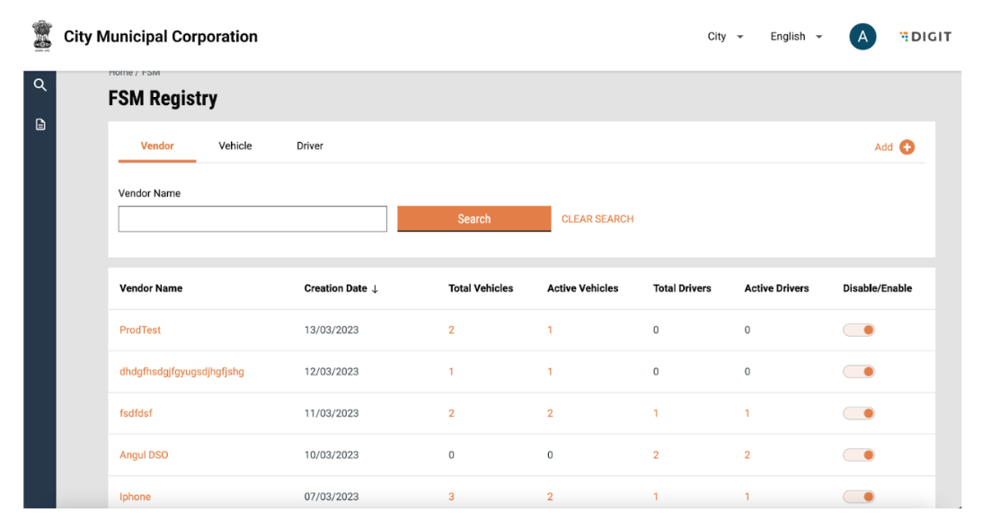

# User Interface Design

The user interface (UI) design is broken up into the following sections:

1. Login
2. Raise a Desludging Request
3. View Applications
4. Accept Applications
5. Payments
6. Assign Desludging Operator
7. Assign Vehicle
8. Complete Request
9. Rate Services
10. Manage Vendor, Driver and Vehicle Details

## 1. Login

### Citizen Login

Find the mock-ups below:

#### Language Selection

When the user opens the application, it first asks them to select the language. The selected language is highlighted in orange color. Once the user selects a language, he/she must click on the ‘Continue’ button which opens the login page.

<figure><figcaption></figcaption></figure>

#### Location Selection

Users are redirected to this screen once they select the preferred language in the previous screen. The city field is a list with radio buttons based on the tenants that are configured in the instance, and the selected radio button is highlighted in orange. The selection of the city will determine the urban local body (ULB) where the application request is raised.

<figure><figcaption></figcaption></figure>

Once the user selects a location and clicks on continue, the user is redirected to the following screen:

<figure><figcaption></figcaption></figure>

The mobile number entered in the application is for all communication purposes. All SMS communication will be sent to the user on the entered number. A user can also access the history of all past and active transactions using this number. The next button will only be deactivated and will be highlighted once the user has entered a valid number. An error message will be displayed if the number is not 10 digits, or alphabets/special characters are entered.&#x20;

On clicking ‘Next’, an OTP will be sent to the user, and the user will be redirected to the following screen:

<figure><figcaption></figcaption></figure>

The screen will prompt the user to enter the OTP sent to the registered mobile number. A counter will be displayed on the screen with a countdown on the number of seconds pending post which the OTP has be re-quested. After 30 seconds, a resend button will be visible to the user. The next button will only be deactivated and will be highlighted once the user has entered an OTP. On clicking ‘Next’, the user will be redirected to the FSM landing page. On entering the incorrect OTP, the user will see an error message that says “Invalid OTP”.

### Employee Login

#### Language Selection

When the user opens the application, it asks them to first select the language. The selected language is highlighted in orange color. Once the user selects a language, he/she must click on the ‘Continue’ button which opens the login page.

<figure><figcaption></figcaption></figure>

#### Login

The user will be provided with a unique system-generated ID and password manually for login.

<figure><figcaption></figcaption></figure>

For an incorrect password, it should show the message “incorrect password” below the password field. If an existing user does not remember his/her password, they must click on “Forgot Password”. This will open a pop-up asking the user to contact the administrator. The ‘OK’ button will collapse the pop-up.

The city field is a dropdown based on the tenets created in the instance. Once all fields are filled, the user can click on ‘Continue’. If any field is not filled, the user will be prompted to fill all fields.

## 2. Raise a Desludging Request

### Citizen Interface

A landing page is available to a citizen on login.

<figure><figcaption></figcaption></figure>

#### Applying for a Desludging Request

The citizen can apply for desludging requests by clicking on “Apply for Emptying Septic Tank/Pit”. This will redirect the user to the service request page.

<figure><figcaption></figcaption></figure>

The user is prompted to enter the “No. of Trips” and the “Vehicle Capacity”. If the user knows the details, he/she can enter the details and click on ‘Next’. If not, the user also has the option to “Skip and Continue”.&#x20;

<figure><figcaption></figcaption></figure>

Once the user clicks on ‘Next’, the user is redirected to “Choose Property Type”. A workflow on the top will show the user in which step of the request form he/she is. The radio button for the selected property type will be highlighted with orange.  The next button will only be deactivated and will be highlighted once the user has selected a property type.

Based on the property type selected, an information box is displayed to the user informing them about the approximate cost of desludging. On clicking next, the user is prompted to “Choose Property Sub-Type”:

<figure><figcaption></figcaption></figure>

The radio button for the selected property type will be highlighted in orange.  The next button will only be deactivated and will be highlighted once the user has selected a property type.

<figure><figcaption></figcaption></figure>

The user is prompted to select the pincode for the property location using the map or search a location using the search bar. The user can also drag the point on the map to the selected location. If the user knows the pin location, he/she can enter the details and click on ‘Next’. If not, the user also has the option to “Skip and Continue”. If the pin location is not selected, the user is redirected to enter the pincode.

<figure><figcaption></figcaption></figure>

The user can enter a 7-digit pincode. If any alphabets/special characters are entered, the user will be prompted with an invalid pincode error. If the user knows the pincode, he/she can enter the details and click on ‘Next’. If not, the user also has the option to “Skip and Continue”.

<figure><figcaption></figcaption></figure>

After this, the user will be redirected to the property address page and he/she will have to select a city and a mohalla. Both of these are dropdowns. The city dropdown is populated based on the tenants created in the system. The list of localities/mohallas will be from the MDMS. The next button will be deactivated and will be highlighted once the user has filled in the details. Once a property address is provided, the user is asked to select whether the property is a slum.

<figure><figcaption></figcaption></figure>

The radio button for the selected option will be highlighted in orange. The next button will only be deactivated and will be highlighted  once the user has selected an option. If yes is selected, the user will be redirected to enter the slum name.&#x20;

<figure><figcaption></figcaption></figure>

The slum name can be selected from a dropdown. The next button will only be deactivated and will be highlighted once the user has selected a slum name. On clicking ‘Next’, the user is redirected to the property address screen.&#x20;

<figure><figcaption></figcaption></figure>

After this, the user will be redirected to the property address page where he/she will have to enter the “Street Name” and “Door/House No”. The ‘Next’ button will be deactivated and will be highlighted  once the user has filled in the details. Once a property address is provided, the user is asked to provide a landmark.

<figure><figcaption></figcaption></figure>

The landmark can be entered by typing in the text box. If the user knows the landmark, he/she can enter the details and click on ‘Next’. If not, the user also has the option to “Skip and Continue”.

<figure><figcaption></figcaption></figure>

The user will be prompted to “Choose Pit type”. The radio button for the selected option will be highlighted in orange.  If the user knows the pit type, he/she can enter the details and click on ‘Next’. If not, the user also has the option to “Skip and Continue”.&#x20;

<figure><figcaption></figcaption></figure>

The user will be prompted to “Upload Pit Photos” by clicking on the camera icon. Once the button is clicked on, the user can choose the camera or select a photo from the gallery. If the user has the photo, he/she can upload the photo and click on ‘Next’. If not, the user also has the option to “Skip and Continue”.&#x20;

<figure><figcaption></figcaption></figure>

The user will be asked to select gender. The radio button for the selected option will be highlighted in orange.  If the user wants to declare their gender, the user can select from Male/Female/Transgender/Others, and click on ‘Next’. If not, the user also has the option to “Skip and Continue”.&#x20;

<figure><figcaption></figcaption></figure>

The user is redirected to the “Payment Details” page. If an advance has been configured in the backend by the ULB, the advance amount is displayed on the screen. The user can enter the advance amount. If an amount below the advance amount is entered, then an error is displayed. To confirm, the user can click on ‘Next’. The user is then prompted to “Check the Answers”.&#x20;

<figure><figcaption></figcaption></figure>

A change option is displayed beside each answer. In case the user wants to edit any details, the user can click on the change button and the user will be redirected to that part of the workflow. If not, the user can click on ‘Submit’.

<figure><figcaption></figcaption></figure>

The user is displayed a confirmation message for application submission along with an application number. A download button can be used to download the application receipt as displayed below. The user can also go back home by clicking on the “Go back to home page” button.

<figure><figcaption></figcaption></figure>

### Employee Interface

A landing page is available to the ULB employee on login.

<figure><figcaption></figcaption></figure>

#### Applying for a Desludging Request

The employee can apply for desludging requests on behalf of the citizen by clicking on “New Desludging Request”. This will redirect the user to a form.&#x20;

<figure><figcaption></figcaption></figure>

The user is prompted to enter the mandatory and non mandatory fields. The “Amount per Trip”, “Total Amount” and “Advance Collection” fields are empty, and will be autopopulated once the “Property Type, “Property Sub-type”, “No. of Trips” and “Vehicle Capacity” are filled.&#x20;

The following validations will be present in the page:&#x20;

1. Mobile number to be 10 digits and cannot be alphanumeric or contain special characters.
2. Advance amount edited cannot be greater than total amount or lesser than minimum amount.&#x20;

The submit button is greyed out and will only show as active when all mandatory fields are filled.&#x20;

Once the user submits the form, the user is redirected to a confirmation page. The confirmation page will display a unique application number. A download option to download the application receipts displayed below is also available. The user can go back to the landing page using the “Go Back to Home” button.

<figure><figcaption></figcaption></figure>

<figure><figcaption></figcaption></figure>

## 3. View Applications

### Citizen Interface

A citizen can view his/her applications by redirecting to “My Applications” from their landing page.

<figure><figcaption></figcaption></figure>

The “My Applications” page lists down all the ongoing applications and will display the Application No., Service Category and Application Status. A view button will be made available along with each application. Once the user clicks on ‘View’, they are redirected to the following page:

<figure><figcaption></figcaption></figure>

The user can view all details of the application on the screen. There is an option to download the application receipt and payment receipts using the Download button.

The application timeline below the application shows the history of the application along with details of the date when the workflow step was completed. If the application is in the “Pending for Payment”, the same will be displayed and a corresponding link will be displayed in the “Application Timeline”.

Similarly, if the application is in the “Pending Citizen Feedback” stage, the same will be displayed and a corresponding link will be displayed in the “Application Timeline”.

### Employee Interface

To view the applications, an employee can navigate to the inbox from the Landing page. The inbox shows a list of all active applications along with their SLAs.

<figure><figcaption></figcaption></figure>

The user can search for an active application using “Application No.” and “Mobile No.” and click on search. This will return the application with the corresponding “Application Number” or the list of applications with the corresponding mobile number. The user can further filter applications based on the criteria on the left hand side, that is, Locality or Status.

To view Past Applications, the user can navigate to Search Applications. Here, users can search for both Active and past applications with the following fields: Application Number, Mobile Number, Status and Locality. On clicking on an application number, the user is redirected to the Application details page.

<figure><figcaption></figcaption></figure>

The user can view all details of the application on the screen. The application timeline below the application shows the history of the application along with details of the date when the workflow step was completed.

## 4. Accept Applications

The ULB employee can accept and update application details when a citizen has raised a request or rejected it.

<figure><figcaption></figcaption></figure>

This can be done by clicking on the “Update Application” button. Details such as locality, number of trips and capacity will be displayed. Clicking on “Update application” will update the status of the application as “Pending for Payment”.

Clicking on “Reject Application’ will reject the application and the user will be prompted to select a reason for rejection and click on submit. Once the application is updated, it will move to pending for payment status if advance payment is applicable.

## 5. Payments

### Citizen Interface

If the application is on the “Payment Pending” stage, the user will have the option to make a payment from the “View Applications” page.

<figure><figcaption></figcaption></figure>

The user can make a payment by clicking on the “Make Payment” button. The user is redirected to the bill details page which displays the total, advance, and due amount.&#x20;

<figure><figcaption></figcaption></figure>

Here, the amount due is prefilled and displayed to the user. If the user is aligned, they can proceed by clicking on “Proceed to Pay”.&#x20;

<figure><figcaption></figcaption></figure>

All payment methods available and configured will be available here as radio buttons. The selected radio button will be filled in orange to display the selection. The user also receives an intimation that they will be redirected to a third-party site. On completion of the payment, the user is redirected to a payment confirmation page. A ‘Print’ receipt option is available to download the payment receipt.

<figure><figcaption></figcaption></figure>

### Employee Interface

Desludging applications pending payment is accessible in the inbox of the user assigned the collector role. The status of the application is reflected in the status column.

<figure><figcaption></figcaption></figure>

By clicking on the application number, the user can view application details.

<figure><figcaption></figcaption></figure>

<figure><figcaption></figcaption></figure>

<figure><figcaption></figcaption></figure>

The user will be able to view details of the application along with details of the Amount Per Trip, Total Amount, and amount to be collected. The application details will also display the status as “Pending for Payment”. The user can proceed to collect payment by clicking on the “Collect Payment” button and the user will be redirected to the “Collect Payment” page.

<figure><figcaption></figcaption></figure>

<figure><figcaption></figcaption></figure>

The user will see information about the amount to be collected and further will be required to fill the following information:

1. Payer Name
2. Payer Phone number

Additionally, the user will be prompted to select the payment mode using radio buttons. The selected radio button will be highlighted in orange. If the user is getting a physical receipt, then the receipt number can be recorded under the Gen/G8 receipt details.

<figure><figcaption></figcaption></figure>

On clicking the submit button, the user is redirected to the payment confirmation screen. The user can download the payment receipt using the ‘Print’ receipt button or go back to the landing page using the “Take Action” button.

<figure><figcaption></figcaption></figure>

## 6. Assign Desludging Operator

Once the payment (if any) is collected, the ULB employee can assign a desludging operator. Applications where DSO needs to be assigned will be shown as “Pending for DSO Assignment” in the inbox.

<figure><figcaption></figcaption></figure>

By clicking on the application number, the user can view application details.

<figure><figcaption></figcaption></figure>

<figure><figcaption></figcaption></figure>

The user can start the process of assigning a DSO by clicking on the “Assign DSO” button. This will display the following pop-up to the user:

<figure><figcaption></figcaption></figure>

The user can select the DSO via a dropdown. The list of DSOs is populated by matching the vehicle capacity requested to the DSOs with vehicles with the required capacity. An expected date of completion is to be selected. Once all fields are filled, the user can assign the selected DSO. An error message will be displayed if a field is left blank. The user can also go back to the application details page by clicking on the ‘Close’ button.

<figure><figcaption></figcaption></figure>

Once the user clicks on ‘Assign’, the status in the workflow timeline will reflect “Pending for DSO Approval”. For any reason, if the DSO is unavailable to service the request, the request can be reassigned to another DSO. This can be done by clicking on the “Take Action” button and clicking on reassign DSO.&#x20;

<figure><figcaption></figcaption></figure>

<figure><figcaption></figcaption></figure>

The same fields need to be filled as that for “Assign DSO”. However, the user is required to select a reason for rejection from a list preconfigured in the backend. An error message will be displayed if a field is left blank. On re-assigning a DSO, the user is displayed a snack bar with confirmation.

<figure><figcaption></figcaption></figure>

The user can also go back to the application details page by clicking on the ‘Close’ button.

## 7. Assign Vehicle

A vehicle can be assigned by both the ULB and the DSO (or basis roles configured) when the application is in the “Pending for DSO Approval” stage. By clicking on the application number, the user can view application details.

<figure><figcaption></figcaption></figure>

<figure><figcaption></figcaption></figure>

The user can start the process of assigning a vehicle by clicking on the “Assign Vehicle” button. This will display the following pop-up to the user.

<figure><figcaption></figcaption></figure>

The user can select the “Vehicle no.” via a dropdown. The list of vehicles is populated by matching the vehicle capacity requested with the required capacity. The vehicle capacity and number of trips are displayed on the pop-up. An error message will be displayed if the vehicle registration number field is left blank. The user can also go back to the application details page by clicking on the ‘Close’ button.

<figure><figcaption></figcaption></figure>

Once the user clicks on ‘Assign”, the status in the Workflow timeline will reflect the “DSO InProgress” stage.&#x20;

<figure><figcaption></figcaption></figure>

At any point during service, the DSO or ULB can update the number of trips. This can be done by clicking on the “Take Action” button and selecting the “Update/Schedule Trips” option.

<figure><figcaption></figcaption></figure>

The user can increase or decrease the number of trips by clicking on the plus or minus sign. The number of trips will increase or decrease and be displayed based on the user's action. The user can confirm the updated number of trips by clicking on the Update/Schedule button. The user can also go back to the application details page by clicking on the ‘Close’ button.

<figure><figcaption></figcaption></figure>

A snack bar will confirm the updated number of trips.

## 8. Complete Request

Once the service request has been completed and all pending payments have been collected, the same has to be confirmed in the system. This can be done by selecting the “Complete Request” button in the “Take Action” button. On clicking on “Complete Request”, the following pop-up is displayed:

<figure><figcaption></figcaption></figure>

The user is required to fill in the following details:

1. Date of Service (selected from a calendar)
2. Volume of Waste collected

Additionally, the user can add optional details such as Pit Type and Pit Dimensions and upload a photo of the Pit. An error message will be displayed if all mandatory fields are not filled.&#x20;

The user can confirm the completion by clicking on the ‘Completed’ button. The user can also go back to the application details page by clicking on the ‘Close’ button.

## 9. Rate Services

if the application is on the Payment Pending stage, the user will have the option to make a payment from the “View Applications” page.

<figure><figcaption></figcaption></figure>

On clicking on ‘View’, the user is redirected to the application details page. The workflow timeline will reflect that the application is pending citizen feedback and a clickable “Rate Us” option is displayed to the user.

<figure><figcaption></figcaption></figure>

Once the user clicks on rate us, the user will be redirected to the following page:&#x20;

<figure><figcaption></figcaption></figure>

The user can provide feedback by selecting one out of 5 stars and selecting safety gears used via a multi-select box. If either of these fields is not filled, the user is displayed an error when clicking on the submit button. Additional comments may be added by the user.&#x20;

On clicking the submit button, the user will be redirected to a confirmation page. The user can use the ‘Download’ button to download any payment or acknowledgement receipts from the users.

<figure><figcaption></figcaption></figure>

## Manage Vendor, Driver and Vehicle Details

The FSM Registry allows for the following actions from the frontend for a particular urban local body (ULB):

* Add new driver, vehicle, vendor
* Edit driver, vehicle, vendor details
* Enable and disable drivers, vehicles and vendors
* Tag driver and vehicle to vendors.

The user can access the ULB registry by clicking on the FSM Registry link in the landing page.

### View Vendor List

<figure><figcaption></figcaption></figure>

The landing page of the FSM registry is defaulted to show the list of vendors in the system. A particular vendor can be searched for by entering the Vendor name in the search bar. Search can be cleared by clicking on the “Clear Search” button.

The user can view the number of associated total and active vehicles and drivers against a vendor. The user can view the details of the tagged vehicles and drivers by clicking on the number. The user can enable/disable the vendor using the toggle.

### Add a Vendor

A new vendor, vehicle or driver can be added by clicking on the plus button on the top right of the page.

<figure><figcaption></figcaption></figure>

On clicking the plus button, the user will be prompted to select whether he/she/it/they/them want to add a Vendor, Driver or Vehicle. To add a new Vendor, the user can click on Vendor and the user will be redirected to the “Add Vendor” page.

<figure><figcaption></figcaption></figure>

A new vendor can be added by entering details such as Vendor Name, personal details, including Gender, Date of Birth, Email and Phone number and Address details such as Door No, Pincode and landmark. Each vendor is created with a unique mobile number and hence, an error message will be displayed if the mobile number has been used to create other vendors. An error message will be displayed if all mandatory fields are not filled.&#x20;

The user can confirm the completion by clicking on the ‘Submit’ button. The user can also go back to the FSM Registry landing page by using the breadcrumbs.

<figure><figcaption></figcaption></figure>

Once the user submits an application, a snack bar will confirm the successful addition of a vendor and details of the added vendor will be displayed in the vendor list.&#x20;

### View and Edit Vendor Details

Vendor details can be viewed by clicking on the vendor name. This will display details such as name, number and address. Details of vehicles and drivers tagged to the vendor will be visible on the screen. The user can go back to the FSM Registry landing page by using the breadcrumbs.

<figure><figcaption></figcaption></figure>

<figure><figcaption></figcaption></figure>

Vendor details can be edited by clicking on the “Take Action" button and selecting edit. Add or edit information and click on “Submit Application”. The changes will reflect on the vendor details page.

<figure><figcaption></figcaption></figure>

<figure><figcaption></figcaption></figure>

<figure><figcaption></figcaption></figure>

A vendor can be deleted by clicking on the “Take Action” button and selecting delete.

<figure><figcaption></figcaption></figure>

A pop-up will be displayed for confirmation. The user can confirm delete by clicking on ‘Delete’ or go back to the vendor details by clicking on ‘Cancel’.

<figure><figcaption></figcaption></figure>

On clicking delete, the user will be redirected to the FSM registry landing page and a snack bar will be displayed confirming that the vendor has been deleted.

### Tagging Vehicles and Drivers to a Vendor

Multiple vehicles can be tagged to a vendor. It is necessary that a vehicle exists in the system before it can be tagged. A vehicle can be tagged to a vendor by clicking on the “Add Vehicle” button in the vendor details page.

<figure><figcaption></figcaption></figure>

A pop-up will be displayed with a dropdown to select a vehicle. Only vehicles that are not tagged to any vendor are to be displayed. The user can select the vehicle number and click on submit or go back to the vendor details page by clicking on close.&#x20;

<figure><figcaption></figcaption></figure>

The added vehicle details will be displayed. The vehicle can be untagged from the vendor by clicking on the delete button against the vehicle details.&#x20;

<figure><figcaption></figcaption></figure>

Multiple drivers can be tagged to a vendor. It is necessary that a driver exists in the system before it can be tagged. A driver can be tagged to a vendor by clicking on the “Add Driver” button in the vendor details page.

<figure><figcaption></figcaption></figure>

A pop-up will be displayed with a dropdown to select a driver. Only drivers that are not tagged to any vendor will be displayed. The user can select the driver name and click on submit or go back to the vendor details page by clicking on close.&#x20;

<figure><figcaption></figcaption></figure>

The added driver details will be displayed. The driver can be untagged from the vendor by clicking on the delete button against the driver details.&#x20;

<figure><figcaption></figcaption></figure>

### View Vehicle List

To view the list of Vehicles, the user can navigate to the Vehicle tab from the FSM Registry landing page.

<figure><figcaption></figcaption></figure>

The user can view the creation date, tagged vendor and status for a vehicle in this page. A particular vehicle can be searched for by entering the vehicle number in the search bar. Search can be cleared by clicking on “Clear Search”. Vehicles can be sorted by creation date, by clicking on the arrow beside the column heading. The user can enable/disable the vehicle using the toggle.

### Add a Vehicle

To add a new vehicle, the user can click on vehicle near the plus button and the user will be redirected to the “Add Vehicle” page.

<figure><figcaption></figcaption></figure>

A new vehicle can be added by entering details such as Vehicle Registration number, Model, Type, Capacity, details of pollution certificate, insurance and road tax. Each vehicle is created with a unique registration number and hence, an error message will be displayed if the registration number has been used to create other vehicles. An error message will be displayed if all mandatory fields are not filled.&#x20;

The user can confirm the completion by clicking on the ‘Submit’ Button. The user can also go back to the FSM Registry landing page by using the breadcrumbs. Once the user submits an application, a snack bar will confirm the successful addition of a vehicle.

<figure><figcaption></figcaption></figure>

Details of the added vehicle will be displayed in the vehicle list.&#x20;

### View and Edit Vehicle Details&#x20;

Vehicle details can be viewed by clicking on the vehicle name. This will display details such as the registration number, vehicle type, make, model, capacity etc. The vendor that the vehicle  is tagged to and whether it is active is also displayed in the details.

<figure><figcaption></figcaption></figure>

Vehicle details can be edited by clicking on the “Take Action” button and selecting edit. Add or edit information and click on submit application. The changes will reflect in the vehicle details page.

<figure><figcaption></figcaption></figure>

<figure><figcaption></figcaption></figure>

A vehicle can be deleted by clicking on the “Take Action” button and selecting delete.

<figure><figcaption></figcaption></figure>

A pop-up will be displayed for confirmation. The user can click on delete to confirm to cancel to go back to vehicle details. The vehicle will be deleted.

<figure><figcaption></figcaption></figure>

### Tagging a Vehicle to a Vendor

Apart from tagging a vehicle to a vendor from the vendor details page, tagging can also be done from the vehicle details page by clicking on the add vendor button. The tagging can be edited by clicking on the edit icon beside Vendor name, in case a vendor is already added.

<figure><figcaption></figcaption></figure>

A pop-up will be displayed with a dropdown to select a vendor.  The user can select the vendor and click on submit or go back to the vehicle details page by clicking on ‘Cancel’.

<figure><figcaption></figcaption></figure>

The added vendor details will be displayed. The vehicle can be untagged from the vendor by clicking on the delete button against the vendor name. The edit (pencil) button allows you to change the vendor tagging.

<figure><figcaption></figcaption></figure>

### View Driver List

To view the list of drivers, the user can navigate to the drivers tab.

<figure><figcaption></figcaption></figure>

The user can view the creation date, tagged vendor, and status for a driver in this page. A particular driver can be searched for by entering the driver name in the search bar. Search can be cleared by clicking on “Clear Search”.

Drivers can be sorted by creation date, by clicking on the arrow beside the column heading. The user can enable/disable the vehicle using the toggle. The user can change the tagging of the Vendor by using the drop down in the “Vendor Name” column.

### Add a Driver

To add a new driver, the user can click on Driver from the plus button and the user will be redirected to the “Add Driver” page.

<figure><figcaption></figcaption></figure>

A new driver can be added by entering details such as Driver Name, and License number. Each vehicle is created with a unique license number and hence, an error message will be displayed if the license number has been used to create other vehicles. An error message will be displayed if all mandatory fields are not filled.&#x20;

The user can confirm the completion by clicking on the ‘Submit’ button. The user can also go back to the FSM Registry landing page by using the breadcrumbs. Once the user submits an application, a snack bar will confirm the successful addition of a driver. Details of the added driver will be displayed in the driver list.

### View and Edit Driver Details&#x20;

Driver details can be viewed by clicking on the driver name. This will display details such as the Name, phone number and license number. The vendor that the driver is tagged to is also displayed in the details.

<figure><figcaption></figcaption></figure>

Driver details can be edited by clicking on the “Take Action” button and selecting edit. The user can add or edit information and click on submit application. The changes will reflect in the driver details page.

<figure><figcaption></figcaption></figure>

A driver can be deleted by clicking on the “Take Action” button and selecting delete.

<figure><figcaption></figcaption></figure>

A pop-up will be displayed for confirmation. The user can click on delete to confirm or view driver details by clicking on cancel. The vehicle will be deleted.

<figure><figcaption></figcaption></figure>

### Tagging a Driver to a Vendor

**Method 1:** Apart from tagging a driver to a vendor from the vendor details page, tagging can also be done from the driver details page by clicking on the add new vendor button.

<figure><figcaption></figcaption></figure>

A pop-up will be displayed with a dropdown to select a vendor.  The user can select the vendor and click on submit or go back to the driver details page by clicking on ‘Cancel’.

<figure><figcaption></figcaption></figure>

The added vendor details will be displayed. The vehicle can be untagged from the vendor by clicking on the delete button against the vendor name. The edit (pencil) button allows you to change the vendor tagging.&#x20;

<figure><figcaption></figcaption></figure>

<figure><figcaption></figcaption></figure>
