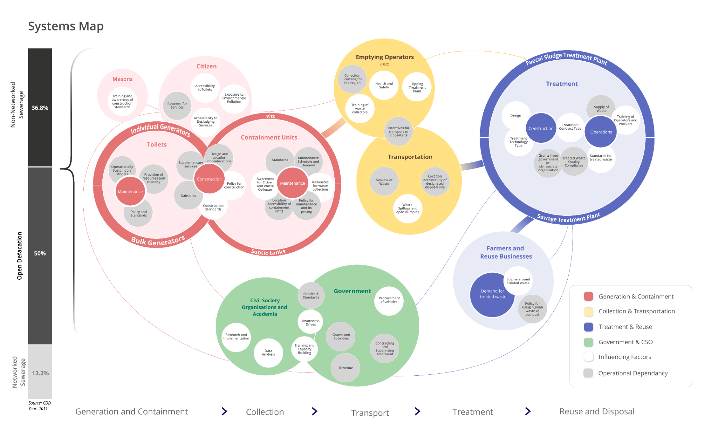
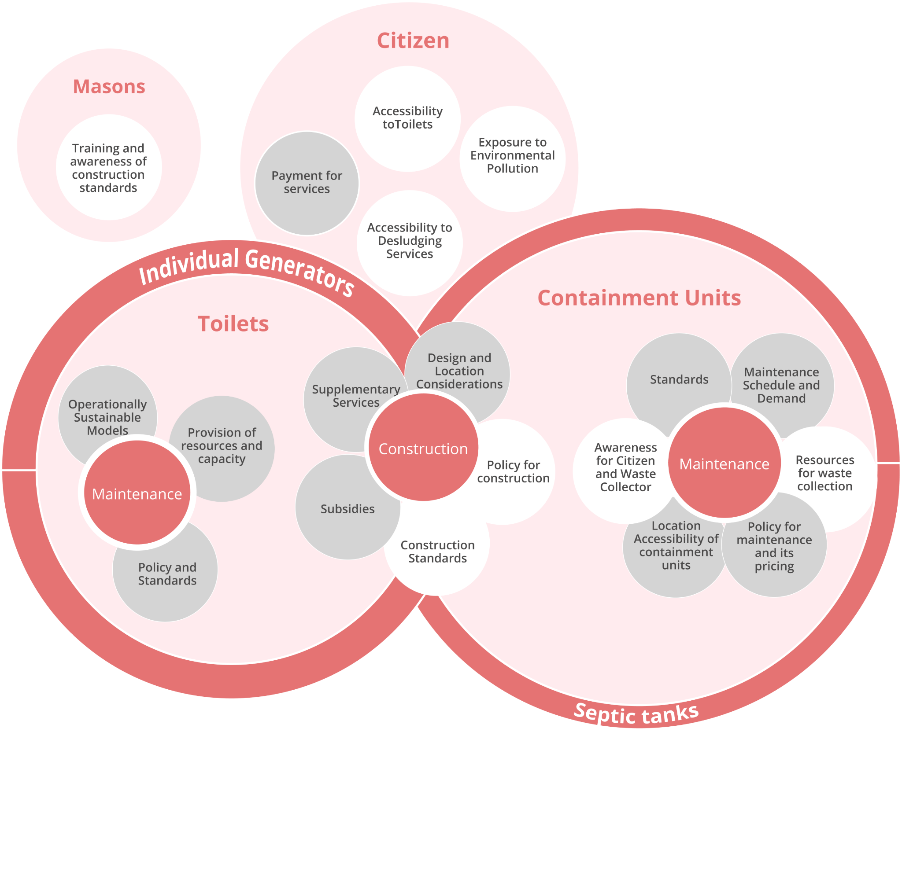
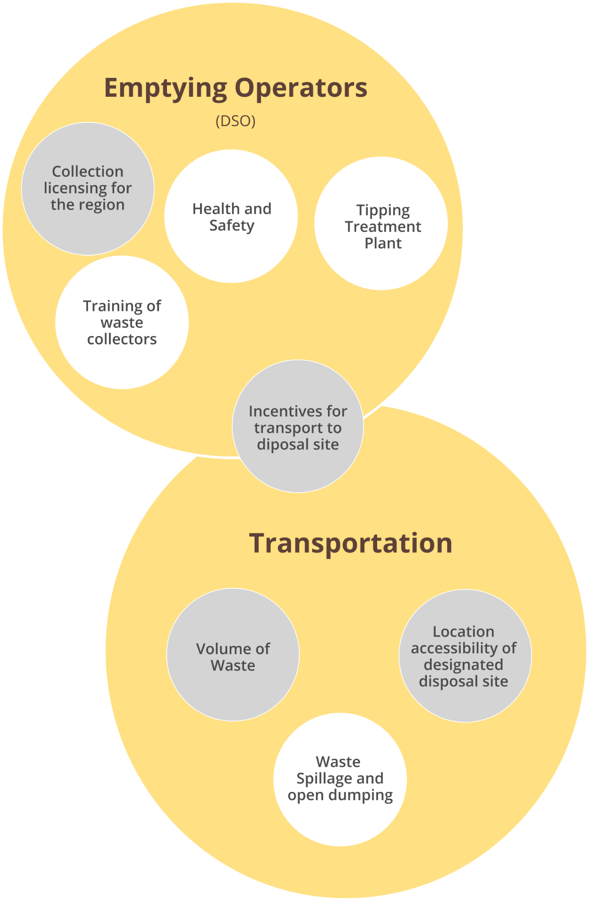
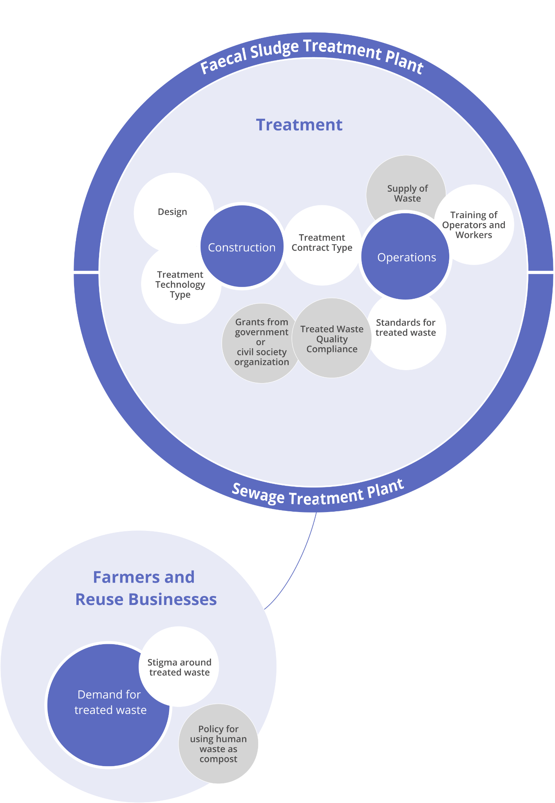
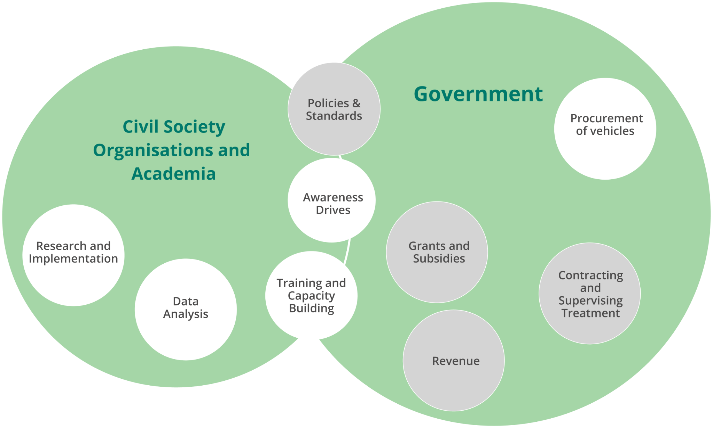

# Products

DIGIT Sanitation started with [**Faecal Sludge Management (FSM)**](faecal-sludge-management-fsm/) and in future, we will pick up Solid Waste Management (SWM). Beyond that, we believe that the platform can be leveraged for other waste streams but the nature of our intervention will be evolve.

## Overview of Faecal Sludge Management&#x20;

The waste we flush down the toilet does not always go into a sewer. Approximately 70% of the households in India have toilets connected to septic tanks or soak pits, technically known as on-site containment systems. They accumulate and store faecal matter over a long period. In sewers, the faecal matter travels daily with a lot of water through long concrete pipes. But in the case of on-site systems, it stays stored for about 3-5 years. Once the storage is full, the waste is emptied and transported to the treatment plant through vacuum trucks. The end-to-end value chain of safe storage, collection, transport, treatment, and end-use or disposal of faecal matter is called Faecal Sludge and Septage Management or FSSM. ‘Faecal Sludge’ and ’Septage’ are used to describe faecal matter in a specific physical and chemical state after prolonged storage.

### Why FSM matters - It is the way forward in sanitation



FSSM has emerged as a cost-efficient population scale alternative to the networked sewer, which has been the traditional method of wastewater management.

1. **Cost-effective:** FSSM is 10 times cheaper than sewer systems.&#x20;
2. **Coverage:** Less than one-third of urban toilet users are connected to sewer systems. The rest are more or less dependent on FSSM systems. Targeting FSSM will help us impact the maximum number of citizens.&#x20;
3. **Scale:** In India's _Swachh Bharat mission_, 11 crore toilets were constructed across the country. Most are connected to on-site systems, which again increases the need for FSSM.

Our current understanding of the problems in septage management is based on our interactions with stakeholders and thorough published reports, and whitepapers. We are aware that FSSM systems have interdependent parts, and each stage of the FSSM value chain impacts how effectively the next stage functions. For instance, if the septic tanks do not have proper access, they will add to the cost of emptying, adding time and cost burden on desludging operators (DSOs). Similarly, it becomes unviable for the DSOs to dump the waste at the treatment plant if it is far from the city which is often the case.

While the linear sanitation value chain provides an understanding of the flow of faecal sludge, it does not capture all stakeholders in the process that control and influence the current effectiveness of sanitation systems.

## Systems Map

We will use a systems mapping approach to outline the different factors and interactions within the sanitation value chain. We will explore systemic challenges at each part of the value chain that result in poor sanitation outcomes.

[Reference Link](https://www.figma.com/proto/MUvgUB6mtfNMFtPEXmmiYx/Lo-Fi-Sanitation?node-id=1245%3A5139\&scaling=contain\&page-id=1074%3A27)

### Part 1 - Toilets and containment units

### Problems faced by key stakeholders&#x20;

**City managers, central/state governments**&#x20;

While sanitation is a priority of the central and state governments, city administrators have been strapped due to deficiencies in standards, building codes, municipal processes, and contracting and monitoring capabilities. These make it difficult to ensure the adequacy, usability, and safety of the toilets provisioned by public funds.

**Masons**&#x20;

Masons are fundamental in proper construction of toilets and containment units. But a majority of masons currently lack the necessary training on construction standards. They are rarely employed using formal contracts, contributinb to the lack of traceability and accountability during the construction of toilets.

**Citizens**&#x20;

Lack of awareness of the impact of improper construction of toilets and containment tanks, or constraints of affordability and space, leads citizens to influence masons to build containment units that do not follow technical standards. It is difficult to identify trained masons and services are procured through social networks and word of mouth.

#### Part 2 - Emptying and transport

### **Problems faced by key stakeholders**

**Desludging operators**

* Lack of proper access to the containment systems adds time-cost to service.
* Treatment plants are located far from the city, making safe dumping unviable.
* While the payment from citizens is a clear incentive for emptying the tanks or pits, there are no incentives to ensure the safe transport of the faecal sludge to the treatment plant.
* Operations remain inefficient without timely and useful information for service delivery. Working conditions are risky, but provisions for personal protection equipment and emergency healthcare services are rare.

**Citizens**&#x20;

* It is difficult to identify and book desludging services and service delivery is not reliable.&#x20;
* Low-income households are denied service since they are not able to afford the full cost.

**City managers, central/state governments**&#x20;

* Challenging to regulate the market for safe dumping without compromising service delivery.&#x20;
* Lack of clear and actionable information in terms of safe or unsafe dumping of faecal sludge.&#x20;
* Lack of pricing policies, infrastructure standards, licensing processes, and contracting and monitoring capacity limit the ability of decision-makers to take action.

#### Part 3 - Treatment

**City managers, centre/state governments**&#x20;

* Difficult to regulate the market across various stages of construction and operations.
* Operational data of the treatment plant and process is often recorded offline and used for post-facto auditing. There is a pervasive lack of actionable information.&#x20;
* Lack of rational pricing policies, comprehensive service benchmarks and infrastructure standards, contracting and monitoring tools hamper corrective action.

**Plant operators**&#x20;

* The supply of desludging load varies in an unreliable and unpredictable manner, and over time, leads to system failure.&#x20;
* Treatment plant management and maintenance is difficult and costly, and the payments are often not linked to performance.&#x20;
* The performance is not directly causally linked to the environmental impact.&#x20;
* Operations are not monitored to facilitate preventive action within the plant, and lack any binding linkages with standard operating procedures and service level agreements.

#### Part 4 - Ecosystem

**Civil society and academia**&#x20;

* In the absence of data, researchers struggle to create new knowledge around the failures, risks, and opportunities, as well as give recommendations for improvement.&#x20;
* Since policy and standards are not mapped to operational data, it is difficult for the ecosystem to translate knowledge to action, impact and access.

**Government**&#x20;

* Inability to trace the impact and proper usage of grants and subsidies for sanitation.&#x20;
* Limited state capacity in terms of budget, skilled human resources, tools, and technology. Coordination across multiple functions, such as standard-setting, policy-making, contracting, audit, monitoring, is needed to keep sanitation systems functional.&#x20;
* Limited penetration of technology, innovation, and competition in the sanitation sector, makes it difficult for the government to enforce accountability across internal processes and market interactions.

## Critical Problems in FSSM

At the core of all systemic challenges, there are problems that hinder a systemic change, limit stakeholders from implementing changes, or even cause the system to collapse. The identified problems are explained below:

### **Absence of well-defined standards for sanitation**

* Current standards do not cover all aspects of sanitation and service delivery - such as standards of treated human waste, treatment plant technologies, and benchmarks, among others.&#x20;
* The ecosystem has created many standards, which are not formally notified or enforced.&#x20;
* Where standards exist, awareness and compliance are dismal for the following reasons:

1. Many actors in the value chain do not have the necessary knowledge, skills, or standard operating procedures.&#x20;
2. Complexities in service delivery result in incomplete or improper service.&#x20;
3. Poor requirement specifications in the Request for Proposals (RFPs) documents.&#x20;
4. Model contracts exist but are not followed.&#x20;
5. Delays in corrective action since contracts are not tightly coupled with monitoring.

### Broken chain of custody from waste generation to reuse&#x20;

* Systemic data either does not exist or remains disjointed to understand how much waste exists, where, when, with whom, and why.&#x20;
* Feacal sludge tends to drop out of the value chain, untreated.The unavailability of the information - who dropped it, when, how, or where it ended up polluting the environment - hampers the process of taking corrective and preventive measures

### Lack of verifiable, trusted data at various levels&#x20;

* Data around faceal sludge (how much, where, when, who is responsible) is too little.&#x20;
* Required data is not created, available, or shared across relevant ecosystem actors. As a result, the performance of sanitation systems remains opaque and unobservable.

### Inability to convert waste to value&#x20;

* Current systems are not structured to maximise the value from faceal sludge and related services.&#x20;
* The policy framework may not recognise treated human excreta as compost. Unclear and fragmented demand for treated waste contributes to lax operations upstream.
